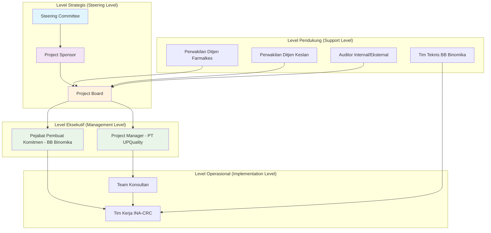
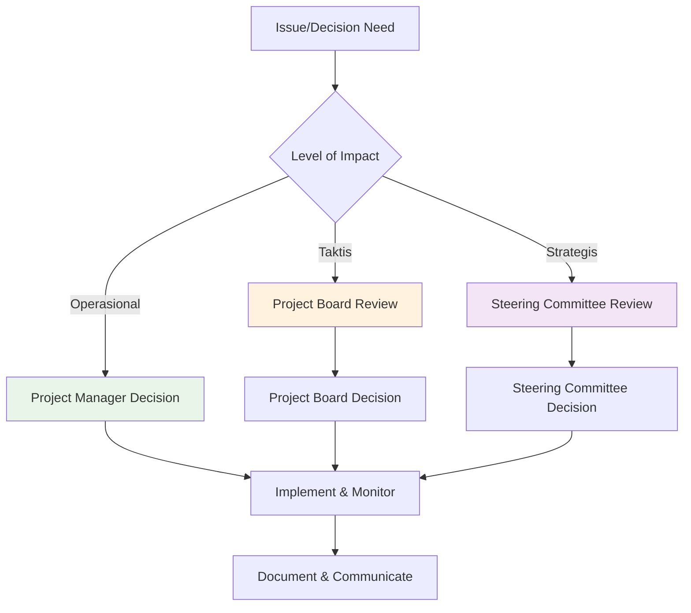
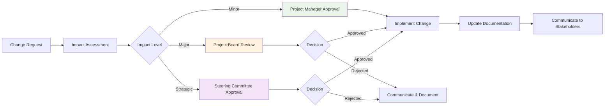

# Dokumen Struktur Tata Kelola Proyek
# Optimalisasi Sistem Tata Kelola INA-CRC

**Versi:** 1.0
**Tanggal:** 29 Oktober 2025
**Proyek:** Optimalisasi Sistem Tata Kelola Indonesia Clinical Research Center (INA-CRC)
**Nomor Kontrak:** SPK 1324 PT Utama Padma Qualiti

---

## 1. Pendahuluan dan Tujuan

### 1.1 Tujuan Dokumen
Dokumen ini mendefinisikan struktur tata kelola proyek (project governance structure) untuk memastikan keberhasilan implementasi "Optimalisasi Sistem Tata Kelola INA-CRC". Struktur ini dirancang untuk:

- Memberikan kejelasan peran, tanggung jawab, dan wewenang setiap pemangku kepentingan
- Memastikan akuntabilitas dan transparansi dalam pengambilan keputusan
- Memfasilitasi komunikasi efektif antar level organisasi
- Menjamin kualitas dan kepatuhan terhadap standar yang berlaku

### 1.2 Ruang Lingkup Tata Kelola
Struktur tata kelola ini mencakup:
- Struktur organisasi proyek dan laporan hierarki
- Peran dan tanggung jawab setiap posisi
- Mekanisme pengambilan keputusan dan eskalasi
- Komunikasi dan pelaporan proyek
- Manajemen risiko dan perubahan

---

## 2. Struktur Organisasi Proyek

### 2.1 Hirarki Tata Kelola

### 2.2 Komposisi Tim

#### **Level Strategis**

**1. Steering Committee**
- **Ketua:** Pejabat Eselon II Ditjen Pelayanan Kesehatan
- **Anggota:**
  - Direktur Jenderal Farmasi dan Alat Kesehatan (atau perwakilan)
  - Direktur Jenderal Kesehatan Lanjutan (atau perwakilan)
  - Kepala Balai Besar Biomedis dan Genomika Kesehatan
- **Wewenang:** Pengambilan keputusan strategis, approve perubahan scope & budget

**2. Project Sponsor**
- **Penanggung Jawab:** Kepala Balai Besar Biomedis dan Genomika Kesehatan
- **Wewenang:** Final approval, resource allocation, strategic guidance

**3. Project Board**
- **Ketua:** Pejabat Pembuat Komitmen (PPK)
- **Anggota:**
  - Project Manager (Konsultan)
  - Kepala Tim Kerja INA-CRC
  - Perwakilan Ditjen Farmalkes
  - Perwakilan Ditjen Keslan
- **Wewenang:** Tactical decisions, risk approval, progress monitoring

#### **Level Eksekutif**

**1. Project Manager (Konsultan)**
- **Penanggung Jawab:** PT Utama Padma Qualiti
- **Direktur Lapor:** Pejabat Pembuat Komitmen
- **Wewenang:** Daily project management, team coordination, deliverable quality

**2. Pejabat Pembuat Komitmen (PPK)**
- **Penanggung Jawab:** BB Binomika
- **Nama:** Winda Wardatul Jannah, S.Si.
- **Wewenang:** Budget control, contractual decisions, formal approvals

#### **Level Operasional**

**1. Tim Konsultan (PT UPQuality)**
- **Project Manager:** Spesialis Tata Kelola
- **Quality Management Specialist:** SOP & Standardization Expert
- **Audit Specialist:** Compliance & Audit Preparation
- **Research Governance Expert:** Clinical Research Best Practices
- **Documentation & Reporting Specialist:** Reporting & Documentation

**2. Tim Kerja INA-CRC**
- **Kepala Tim Kerja:** Koordinator Operasional INA-CRC
- **Anggota Tim:** Staff fungsional INA-CRC
- **Fokus:** Implementation support, local coordination, system adoption

---

## 3. Peran dan Tanggung Jawab

### 3.1 Matriks RACI (Responsible, Accountable, Consulted, Informed)

| Aktivitas/Keputusan | Steering Committee | Project Sponsor | Project Board | Project Manager | PPK | Tim INA-CRC | Ditjen Farmalkes | Ditjen Keslan |
|---------------------|-------------------|-----------------|---------------|-----------------|-----|-------------|------------------|---------------|
| **Strategic Planning** | A | R | C | C | I | I | C | C |
| **Budget Allocation** | A | R | C | I | R | I | I | I |
| **Scope Changes** | A | R | A | C | C | I | C | C |
| **Contract Management** | I | A | C | R | R | I | I | I |
| **Risk Management** | I | A | A | R | C | C | C | C |
| **Quality Assurance** | I | A | C | R | C | C | C | I |
| **Progress Reporting** | I | A | R | R | R | C | C | C |
| **Stakeholder Management** | R | A | C | R | C | C | C | C |
| **Implementation Decisions** | I | I | C | A | C | R | C | C |
| **Technical Specifications** | I | I | C | R | I | A | C | I |
| **Training & Capacity Building** | I | I | C | R | C | A | I | C |
| **Audit Preparation** | I | A | C | R | C | A | C | I |

**Keterangan:**
- **R (Responsible):** Melaksanakan aktivitas
- **A (Accountable):** Bertanggung jawab atas hasil akhir
- **C (Consulted):** Dimintai masukan/opini
- **I (Informed):** Diberitahu hasilnya

---

## 4. Mekanisme Pengambilan Keputusan

### 4.1 Tingkat Keputusan

#### **Level Strategis (Steering Committee)**
- **Approval Threshold:** Perubahan scope >20%, budget >15%, timeline >4 minggu
- **Frequency Meeting:** Kuartalan
- **Decision Making:** Konsensus atau majority vote

#### **Level Taktis (Project Board)**
- **Approval Threshold:** Perubahan scope ≤20%, budget ≤15%, timeline ≤4 minggu
- **Frequency Meeting:** Dwi mingguan
- **Decision Making:** Konsensus dengan Project Manager sebagai facilitator

#### **Level Operasional (Project Manager)**
- **Authority:** Daily operational decisions, task assignments, quality control
- **Frequency Meeting:** Harian dengan tim, mingguan dengan PPK
- **Decision Making:** Autonom based on project plan

### 4.2 Eskalasi Path

### 4.3 Conflict Resolution

1. **Level 1:** Project Manager & PPK negotiation
2. **Level 2:** Project Board mediation
3. **Level 3:** Steering Committee arbitration
4. **Level 4:** Formal escalation to Kementerian leadership

---

## 5. Struktur Komunikasi dan Pelaporan

### 5.1 Komunikasi Internal

#### **Meeting Schedule**
- **Daily Stand-up:** Tim Konsultan (Hari kerja, 09:00)
- **Weekly Coordination:** Project Manager + PPK + Tim INA-CRC (Jumat, 14:00)
- **Bi-weekly Review:** Project Board (Selasa ke-2 dan ke-4, 10:00)
- **Monthly Steering:** Steering Committee (Jumat pertama, 13:00)

#### **Communication Channels**
- **Formal:** Email, Official Letters
- **Informal:** WhatsApp Group, Slack
- **Documentation:** Shared Drive (Google Workspace/SharePoint)
- **Issue Tracking:** Project Management Tools (Asana/Trello)

### 5.2 Pelaporan Eksternal

#### **Reporting Matrix**
| Jenis Laporan | Penerima | Frekuensi | Format | Due Date |
|---------------|----------|-----------|--------|----------|
| Status Report Harian | Tim Proyek | Harian | Email | 17:00 WIB |
| Progress Report Mingguan | Project Board | Mingguan | PDF + Dashboard | Jumat sore |
| Monthly Executive Summary | Steering Committee | Bulanan | Executive Memo | Tanggal 1 |
| Quarterly Performance Review | Kemenkes Leadership | Kuartalan | Formal Report | Minggu ke-2 |
| Issue/Risk Alert | Relevant Stakeholders | As needed | Alert Memo | Immediate |

#### **Key Performance Indicators (KPI) Reporting**
- **Project Health:** Schedule, Budget, Quality, Scope metrics
- **Delivery Progress:** Milestone completion, deliverable status
- **Risk Management:** Risk identification, mitigation progress
- **Stakeholder Satisfaction:** Feedback scores, engagement levels

---

## 6. Manajemen Risiko dan Perubahan

### 6.1 Risk Governance Structure

**Risk Management Committee:**
- **Ketua:** Project Manager
- **Anggota:** Quality Specialist, Audit Specialist, Kepala Tim INA-CRC
- **Frequency:** Weekly risk review, Monthly comprehensive assessment

**Risk Categories & Owners:**
- **Strategic Risk:** Steering Committee
- **Operational Risk:** Project Manager
- **Financial Risk:** PPK
- **Technical Risk:** Quality Specialist + Tim Teknis BB Binomika
- **Stakeholder Risk:** Project Board

### 6.2 Change Management Process

**Change Thresholds:**
- **Minor (PM Approval):** Cost ≤Rp 2.500.000, Time ≤3 hari, Scope adjustment ≤5%
- **Major (Board Approval):** Cost ≤Rp 10.000.000, Time ≤2 minggu, Scope adjustment ≤15%
- **Strategic (Steering Approval):** Cost >Rp 10.000.000, Time >2 minggu, Scope adjustment >15%

---

## 7. Manajemen Kualitas dan Kepatuhan

### 7.1 Quality Assurance Framework

**Quality Management Committee:**
- **Ketua:** Quality Management Specialist
- **Anggota:** Audit Specialist, Research Governance Expert, Tim INA-CRC Lead

**Quality Control Activities:**
- **Document Review:** SOP, KPI, Deliverables
- **Process Audit:** Implementation compliance
- **Stakeholder Feedback:** Regular satisfaction surveys
- **Performance Monitoring:** KPI tracking & reporting

### 7.2 Compliance Requirements

**Regulatory Compliance:**
- **Good Clinical Practice (GCP):** ICH-GCP Guidelines
- **National Regulations:** KMK 1458/2023, KMK 1265/2024, PMK No. 12/2025
- **Institutional Standards:** BB Binomika SOPs, Kemenkes procedures

**Audit Requirements:**
- **Internal Audit:** Quarterly quality audits
- **External Audit:** Annual compliance audit
- **Special Audit:** As requested by stakeholders

---

## 8. Dokumen Referensi

1. **Surat Perintah Kerja (SPK) No. 1324**
2. **Proposal Penawaran Optimalisasi Sistem Tata Kelola INA-CRC**
3. **Rencana Strategis INA-CRC 2025-2029**
4. **INA-CRC Strategic Blueprint**
5. **Project Planning Document**
6. **SOP Template INA-CRC v0.1**
7. **KMK 1458/2023, KMK 1265/2024, PMK No. 12/2025**

---

## 9. Persetujuan

Dokumen Struktur Tata Kelola Proyek ini telah disetujui oleh:

| Nama | Jabatan | Tanda Tangan | Tanggal |
|------|---------|--------------|---------|
| [Nama Pejabat] | Project Sponsor / Kepala BB Binomika | | |
| [Nama Pejabat] | Pejabat Pembuat Komitmen | | |
| [Nama Pejabat] | Project Manager, PT UPQuality | | |
| [Nama Pejabat] | Kepala Tim Kerja INA-CRC | | |

---

**Catatan Penting:**
- Struktur tata kelola ini efektif sejak tanggal ditandatangani
- Perubahan terhadap struktur ini harus melalui proses change management yang berlaku
- Setiap anggota tim wajib memahami dan melaksanakan peran serta tanggung jawabnya sesuai dokumen ini