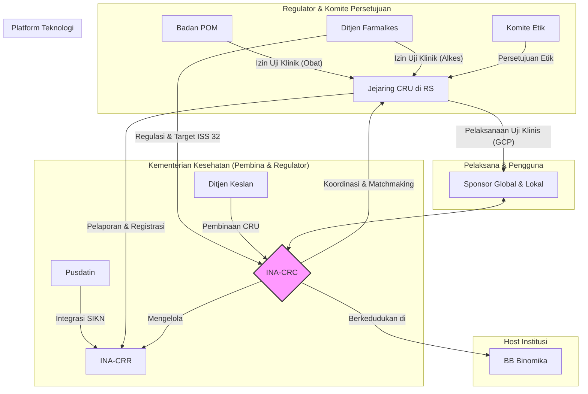
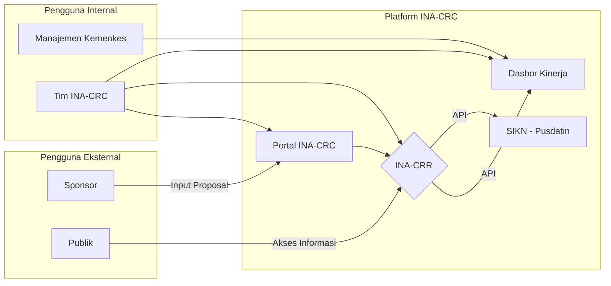

# Cetak Biru Strategis INA-CRC: Arsitektur Tata Kelola Uji Klinis Nasional

**Status:** FINAL
**Versi:** 1.0
**Tanggal Pengesahan:** 28 November 2025
**Referensi:** Rencana_Strategis_INA-CRC_2025-2029_FINAL.md

---

## 1. Visi dan Prinsip Panduan

*   **Visi:** Menjadikan Indonesia sebagai destinasi utama pelaksanaan uji klinis di Asia Tenggara melalui tata kelola yang terintegrasi, transparan, dan berstandar internasional.
*   **Prinsip Panduan:**
    *   **Kepatuhan (Compliance):** Semua proses berpegang pada standar *Good Clinical Practice* (GCP), regulasi nasional, dan prinsip etik.
    *   **Sentralisasi (Centralization):** INA-CRC bertindak sebagai *single entry point* dan koordinator utama untuk semua kegiatan uji klinis.
    *   **Transparansi (Transparency):** Alur kerja, status, dan hasil uji klinis dapat diakses melalui sistem terintegrasi (INA-CRR).
    *   **Kolaborasi (Collaboration):** Mendorong kerja sama yang erat antara regulator, industri/sponsor, akademisi, dan fasilitas kesehatan.
    *   **Pembinaan (Enablement):** Fokus pada peningkatan kapasitas dan kemandirian *Clinical Research Unit* (CRU) di seluruh Indonesia.

---

## 2. Arsitektur Tata Kelola Ekosistem

Blueprint ini mendefinisikan INA-CRC sebagai pusat dari ekosistem uji klinis nasional.

*   **INA-CRC (Pusat):** Berfungsi sebagai **Tim Kerja** di bawah **BB Binomika**. Merupakan pusat koordinasi, fasilitator, dan *matchmaker*.
*   **Regulator & Pembina:**
    *   **Ditjen Farmalkes:** Menetapkan kebijakan, regulasi, dan memberikan **izin uji klinis alat kesehatan**.
    *   **Badan POM:** Memberikan **izin uji klinis obat**.
    *   **Ditjen Keslan:** Bertanggung jawab untuk membina dan meningkatkan kapasitas CRU.
*   **Pelaksana:**
    *   **Clinical Research Units (CRU):** Ujung tombak pelaksanaan uji klinis di rumah sakit, harus tersertifikasi GCP.
    *   **Sponsor:** Industri atau lembaga riset yang mendanai penelitian.

---

## 3. Arsitektur Proses Inti (End-to-End)

Alur kerja utama dirancang untuk efisiensi dan transparansi, dengan INA-CRC sebagai gerbang utama.

| Tahap | Aktor Utama | Deskripsi Aktivitas | Output Kunci |
| :--- | :--- | :--- | :--- |
| **1. Inisiasi & Registrasi** | Sponsor, INA-CRC | Sponsor mengajukan proposal melalui *single entry point* INA-CRC. Proposal diregistrasikan di **INA-CRR**. | Proposal terdaftar dengan nomor unik. |
| **2. Feasibility & Matchmaking** | INA-CRC, Sponsor, CRU | INA-CRC melakukan studi kelayakan dan merekomendasikan CRU yang paling sesuai kepada sponsor. | Rekomendasi CRU & Hasil *Feasibility Study*. |
| **3. Perjanjian & Persiapan** | Sponsor, CRU, INA-CRC | Negosiasi *Clinical Trial Agreement* (CTA) antara Sponsor dan CRU, difasilitasi oleh INA-CRC. | CTA ditandatangani. |
| **4. Persetujuan Regulasi & Etik** | CRU, Komite Etik, Regulator | CRU mengajukan permohonan persetujuan secara paralel ke Komite Etik dan Regulator (Badan POM/Farmalkes). | Surat Persetujuan Etik & Izin Pelaksanaan Uji Klinik (PPUK). |
| **5. Pelaksanaan & Monitoring** | CRU, Sponsor | CRU melaksanakan uji klinis sesuai protokol GCP. Sponsor melakukan monitoring. | Data uji klinis & Laporan monitoring. |
| **6. Pelaporan & Penutupan** | CRU, Sponsor, INA-CRC | Hasil uji klinis dilaporkan dan statusnya diperbarui di INA-CRR. Proyek ditutup secara resmi. | Laporan akhir studi & data di INA-CRR. |

---

## 4. Arsitektur Sistem dan Teknologi

Komponen teknologi mendukung proses bisnis untuk memastikan integrasi dan visibilitas data.

*   **Indonesia Clinical Research Registry (INA-CRR):** Database pusat yang menjadi *single source of truth* untuk semua uji klinis di Indonesia.
*   **Portal INA-CRC:** Gerbang untuk sponsor melakukan pengajuan dan bagi tim INA-CRC untuk mengelola alur kerja.
*   **Dasbor Kinerja:** Alat bantu visual bagi manajemen untuk memantau metrik kunci.
*   **Integrasi:** INA-CRR dirancang untuk dapat berinteraksi melalui API dengan Sistem Informasi Kesehatan Nasional (SIKN).

---

## 5. Peta Jalan Implementasi

| Fase | Fokus Utama | Jangka Waktu | Metrik Keberhasilan Utama |
| :--- | :--- | :--- | :--- |
| **Fase 1: Fondasi & Tata Kelola** | - Finalisasi SOP & alur kerja inti. - Pengembangan prototipe INA-CRR & Dasbor. | 6 Bulan | - SOP diadopsi. - Prototipe INA-CRR berfungsi. |
| **Fase 2: Implementasi & Penguatan** | - Implementasi alur kerja pada Tim INA-CRC. - Pelatihan intensif untuk Tim Kerja. - Uji coba integrasi sistem. | 12 Bulan | - Minimal 10 uji klinis berjalan melalui alur baru. - Tim INA-CRC mampu memfasilitasi sertifikasi GCP. |
| **Fase 3: Eskalasi & Optimalisasi** | - Perluasan implementasi ke jejaring CRU. - Peluncuran penuh INA-CRR untuk publik. - Harmonisasi kebijakan lintas sektor. | 24 Bulan+ | - Peningkatan jumlah uji klinis terdaftar. - Target ISS 32 tercapai. |
