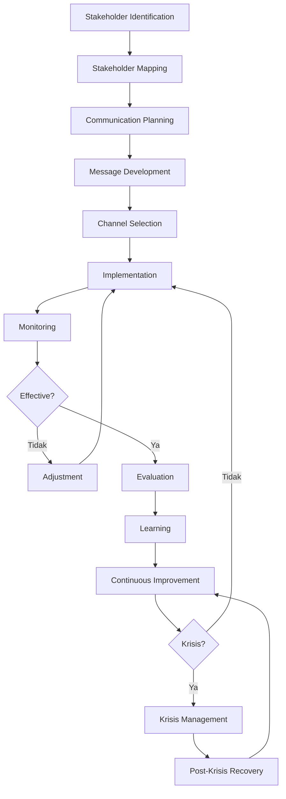

# INACRC-SOP-105 Manajemen Stakeholder dan Komunikasi

## INFORMASI DOKUMEN

| Item | Keterangan |
|------|------------|
| **Judul** | Standard Operating Procedure (SOP) Manajemen Stakeholder dan Komunikasi |
| **No. Dokumen** | INACRC-SOP-MANAGEMENT-105-2025 |
| **Versi** | 1.0 |
| **Tanggal Berlaku** | 01 Desember 2025 |
| **Tanggal Review** | 01 Juni 2026 |
| **Tingkat Kerahasiaan** | Internal |
| **Lampiran** | 6 lampiran |
| **Ditetapkan oleh** | Kepala INA-CRC |
| **Disetujui oleh** | Direktur BB Binomika |
| **Dikendalikan oleh** | Unit Manajemen Mutu INA-CRC |

## DAFTAR PERUBAHAN

| Versi | Tanggal | Perubahan | Paraf |
|-------|---------|-----------|-------|
| 1.0 | 27 Nov 2025 | Pembuatan SOP awal | Draft |

## 1. TUJUAN

### 1.1 Tujuan Utama
SOP ini bertujuan untuk:
- Menstandarkan proses manajemen stakeholder dalam operasional INA-CRC
- Memastikan komunikasi yang efektif dan konsisten dengan semua stakeholders
- Membangun hubungan yang positif dan produktif dengan ekosistem uji klinis
- Mendukung kesuksesan implementasi uji klinis melalui stakeholder engagement yang optimal

### 1.2 Tujuan Spesifik
- Mengidentifikasi dan memetakan semua stakeholders relevan
- Menetapkan strategi komunikasi yang sesuai untuk setiap stakeholder
- Memfasilitasi dialog dua arah yang konstruktif dan transparan
- Mengelola ekspektasi dan hubungan stakeholder secara proaktif

## 2. RUANG LINGKUP

### 2.1 Aplikasi
SOP ini berlaku untuk:
- Semua aktivitas komunikasi dan stakeholder engagement INA-CRC
- Semua level interaksi dari operasional hingga strategis
- Semua stakeholder: regulator, sponsor, CRU, pasien, media, publik
- Semua channel komunikasi: digital, tatap muka, publikasi

### 2.2 Pengecualian
SOP ini tidak berlaku untuk:
- Komunikasi pribadi staff yang tidak terkait pekerjaan
- Komunikasi legal formal yang diatur secara khusus
- Komunikasi emergency medical situations
- Komunikasi rahasia tingkat tertinggi yang dilindungi undang-undang

## 3. REFERENSI

### 3.1 Regulasi Nasional
- Peraturan Badan POM No. 8 Tahun 2024 tentang CPKB Uji Klinik
- Keputusan Menteri Kesehatan No. 1458 Tahun 2023 tentang Tata Kelola Uji Klinis
- Keputusan Menteri Kesehatan No. 1265 Tahun 2024 tentang Standar Etik Penelitian
- UU No. 14 Tahun 2008 tentang Keterbukaan Informasi Publik

### 3.2 Standar Internasional
- ICH-GCP E6(R2) Guidelines - Communication Requirements
- WHO Guidelines for Clinical Trial Communication
- ISO 26000:2010 Guidance on Social Responsibility
- PMI Standards for Stakeholder Engagement

### 3.3 Dokumen Terkait INA-CRC
- INACRC-SOP-MANAGEMENT-001: SOP Penyusunan Pembuatan SOP
- INACRC-SOP-QMS-002: SOP Manajemen Dokumen Terkendali
- INACRC-SOP-101: SOP Koordinasi dengan Pemangku Kepentingan Eksternal
- INACRC-SOP-102: SOP Penanganan Masalah dan Eskalasi

## 4. DEFINISI

### 4.1 Istilah Teknis
- **Stakeholder**: Individu atau organisasi yang dapat mempengaruhi atau terpengaruh oleh aktivitas INA-CRC
- **Stakeholder Engagement**: Proses interaksi dan komunikasi berkelanjutan dengan stakeholders
- **Communication Plan**: Dokumen terstruktur yang mengatur strategi dan aktivitas komunikasi
- **Key Message**: Pesan inti yang konsisten yang ingin disampaikan kepada stakeholders
- **Feedback Loop**: Proses untuk mengumpulkan, menganalisis, dan merespons masukan stakeholder
- **Stakeholder Mapping**: Proses identifikasi dan analisis stakeholder berdasarkan kepentingan dan pengaruh

### 4.2 Singkatan
- SOP: Standard Operating Procedure
- CRU: Clinical Research Unit
- CRO: Clinical Research Organization
- PI: Principal Investigator
- KEP: Komite Etik Penelitian
- SLA: Service Level Agreement
- KPI: Key Performance Indicator

## 5. TANGGUNG JAWAB

### 5.1 Kepala INA-CRC
- Menyetujui strategi manajemen stakeholder dan komunikasi
- Menjadi juru bicara senior untuk komunikasi level tinggi
- Memelihara hubungan dengan stakeholders level eksekutif
- Memberikan arahan untuk krisis komunikasi

### 5.2 Manajer Stakeholder
- Mengembangkan dan mengimplementasikan strategi stakeholder engagement
- Mengkoordinasikan aktivitas komunikasi lintas fungsi
- Melakukan analisis stakeholder dan kebutuhan komunikasi
- Memantau efektivitas komunikasi dan stakeholder satisfaction

### 5.3 Koordinator Komunikasi
- Melaksanakan aktivitas komunikasi harian
- Menyiapkan materi komunikasi dan publikasi
- Mengelola digital platforms dan media sosial
- Mendokumentasikan semua aktivitas komunikasi

### 5.4 PIC Fungsional
- Menjadi kontak utama untuk stakeholders spesifik
- Memberikan informasi akurat dan tepat waktu
- Mengidentifikasi kebutuhan informasi stakeholder
- Melaporkan isu komunikasi kepada manajemen

### 5.5 Satuan Tata Usaha
- Mengelola administrasi komunikasi dan dokumentasi
- Menyediakan layanan sekretariat untuk pertemuan dan event
- Mengelola arsip digital dan fisik komunikasi
- Memberikan dukungan teknis untuk presentasi

## 6. PROSEDUR

### 6.1 Stakeholder Identification dan Mapping

#### 6.1.1 Stakeholder Analysis
1. **Identification Process**:
   - **Primary Stakeholders**: Pasien, PI, staff CRU, sponsor, regulator
   - **Secondary Stakeholders**: CRO, komunitas medis, asosiasi profesi
   - **Tertiary Stakeholders**: Media, publik, pemerintah lokal, masyarakat sipil
   - **Internal Stakeholders**: Staff INA-CRC, manajemen, support units

2. **Stakeholder Matrix**:
   - **Power**: Kemampuan untuk mempengaruhi keputusan dan implementasi
   - **Interest**: Tingkat kepentingan dan kepedulian terhadap aktivitas INA-CRC
   - **Influence**: Kapabilitas untuk mempengaruhi opini dan kebijakan
   - **Impact**: Tingkat dampak yang dialami dari aktivitas INA-CRC

#### 6.1.2 Stakeholder Mapping
1. **Mapping Framework**:
   - **Power-Interest Matrix**: Kategorisasi prioritas engagement
   - **Influence-Impact Matrix**: Strategi komunikasi yang sesuai
   - **Lifecycle Mapping**: Kebutuhan informasi berdasarkan fase uji klinis
   - **Communication Channel Preferences**: Metode komunikasi yang efektif

2. **Segmentation Strategy**:
   - **High Power/High Interest**: Manage Closely (Kemenkes, Badan POM, Sponsor Utama)
   - **High Power/Low Interest**: Keep Satisfied (Pemerintah Daerah, Regulator Regional)
   - **Low Power/High Interest**: Keep Informed (Pasien, Komunitas Medis)
   - **Low Power/Low Interest**: Monitor (Media, Publik Umum)

### 6.2 Strategi Komunikasi

#### 6.2.1 Communication Planning
1. **Strategic Communication Objectives**:
   - **Awareness**: Meningkatkan pemahaman tentang peran INA-CRC
   - **Understanding**: Memastikan interpretasi yang benar tentang informasi
   - **Engagement**: Mendorong partisipasi aktif stakeholders
   - **Support**: Membangun dukungan untuk kebijakan dan program
   - **Action**: Memotivasi perilaku yang diinginkan

2. **Message Development**:
   - **Core Messages**: 3-5 pesan inti yang konsisten dan jelas
   - **Targeted Messages**: Pesan yang disesuaikan dengan kebutuhan stakeholder spesifik
   - **Evidence-Based Support**: Data dan fakta untuk mendukung pesan
   - **Call to Action**: Permintaan spesifik yang diinginkan dari stakeholder

3. **Channel Selection**:
   - **Direct Channels**: Email, telepon, pertemuan tatap muka, webinars
   - **Digital Platforms**: Website, media sosial, aplikasi mobile, newsletter
   - **Public Channels**: Press releases, konferensi pers, publikasi ilmiah
   - **Network Channels**: Asosiasi profesi, komunitas praktik, event industri

#### 6.2.2 Communication Implementation
1. **Scheduled Communications**:
   - **Regular Updates**: Bulanan, kuartalan, atau tahunan sesuai kebutuhan
   - **Event-Based Communications**: Acara spesifik, pengumuman penting
   - **Reactive Communications**: Respon terhadap kejadian atau pertanyaan
   - **Proactive Communications**: Inisiatif komunikasi untuk isu antisipasi

2. **Content Development**:
   - **Newsletters**: Update teratur dengan informasi relevan dan berguna
   - **Announcements**: Pengumuman resmi dengan format standar
   - **Educational Content**: Materi edukasi tentang uji klinis dan INA-CRC
   - **Success Stories**: Studi kasus dan testimoni yang menginspirasi

3. **Digital Communication Management**:
   - **Website Management**: Update konten reguler dan optimisasi pengalaman pengguna
   - **Social Media**: Konten terjadwal dan interaksi dengan followers
   - **Email Marketing**: Segmentasi dan personalisasi pesan
   - **Mobile Apps**: Akses mudah ke informasi dan layanan

### 6.3 Stakeholder Engagement

#### 6.3.1 Engagement Activities
1. **Formal Engagement**:
   - **Stakeholder Meetings**: Pertemuan terjadwal dengan agenda terstruktur
   - **Workshops**: Sesi kolaboratif untuk diskusi topik spesifik
   - **Consultations**: Proses formal untuk mendapat masukan kebijakan
   - **Forums**: Platform diskusi terbuka untuk stakeholders

2. **Informal Engagement**:
   - **Networking Events**: Acara untuk membangun hubungan personal
   - **Site Visits**: Kunjungan ke fasilitas CRU dan sponsor
   - **Informal Discussions**: Konsultasi informal dan ad hoc communication
   - **Social Events**: Acara sosial untuk memperkuat hubungan

3. **Digital Engagement**:
   - **Webinars**: Presentasi online dengan Q&A interaktif
   - **Virtual Town Halls**: Forum diskusi digital terbuka
   - **Online Communities**: Platform kolaborasi untuk stakeholders
   - **Digital Surveys**: Koleksi masukan secara efisien dan skala besar

#### 6.3.2 Relationship Management
1. **Relationship Building**:
   - **Stakeholder Profiles**: Database lengkap dengan preferensi dan riwayat interaksi
   - **Personalized Communication**: Pesan yang disesuaikan dengan individu/organisasi
   - **Recognition Programs**: Penghargaan untuk kontribusi stakeholder
   - **Milestone Celebrations**: Perayaan pencapaian bersama

2. **Conflict Management**:
   - **Early Detection**: Identifikasi potensi konflik sebelum membesar
   - **Mediation Processes**: Proses netral untuk menyelesaikan perselisihan
   - **Issue Resolution**: Sistematis untuk menangani keluhan dan isu
   - **Reconciliation**: Upaya memulihkan hubungan setelah konflik

3. **Trust Building**:
   - **Transparency**: Keterbukaan informasi dan proses pengambilan keputusan
   - **Consistency**: Konsistensi pesan dan tindakan sepanjang waktu
   - **Accountability**: Pertanggung jawaban atas janji dan komitmen
   - **Responsiveness**: Respon cepat terhadap pertanyaan dan kebutuhan

### 6.4 Monitoring dan Evaluasi

#### 6.4.1 Performance Monitoring
1. **KPI Communication**:
   - **Reach Metrics**: Jumlah dan demografi audience tercapai
   - **Engagement Metrics**: Tingkat interaksi dan partisipasi stakeholder
   - **Satisfaction Metrics**: Kepuasan stakeholder terhadap komunikasi
   - **Effectiveness Metrics**: Pencapaian tujuan komunikasi

2. **Monitoring Tools**:
   - **Media Monitoring**: Tracking pemberitaan dan diskusi media
   - **Social Media Analytics**: Analisis engagement dan sentimen
   - **Survey Results**: Reguler stakeholder satisfaction surveys
   - **Feedback Analysis**: Analisis kualitatif dari stakeholder feedback

3. **Dashboard Development**:
   - **Real-time Monitoring**: Live dashboard untuk communication metrics
   - **Trend Analysis**: Identifikasi pola dan perubahan sepanjang waktu
   - **Benchmarking**: Perbandingan dengan standar industri atau best practices
   - **Alert Systems**: Notifikasi untuk isu atau peluang komunikasi

#### 6.4.2 Effectiveness Evaluation
1. **Evaluation Framework**:
   - **Input Evaluation**: Kualitas resources dan perencanaan komunikasi
   - **Process Evaluation**: Efisiensi dan efektivitas implementasi
   - **Output Evaluation**: Kualitas dan kuantitas deliverables komunikasi
   - **Outcome Evaluation**: Dampak aktual terhadap perilaku dan hubungan stakeholder

2. **Evaluation Methods**:
   - **Stakeholder Interviews**: Diskusi mendalam dengan stakeholder kunci
   - **Focus Group Discussions**: Grup diskusi untuk temuan mendalam
   - **Case Studies**: Analisis kasus sukses dan tantangan
   - **Pre-Post Assessments**: Perbandingan sebelum dan sesudah intervensi

3. **Continuous Improvement**:
   - **Lessons Learned**: Dokumentasi pembelajaran dari setiap aktivitas
   - **Best Practice Development**: Identifikasi dan dokumentasi best practices
   - **Process Optimization**: Perbaikan berkelanjutan terhadap proses komunikasi
   - **Innovation Adoption**: Adopsi teknologi dan metode komunikasi baru

### 6.5 Krisis Komunikasi

#### 6.5.1 Krisis Identification dan Assessment
1. **Krisis Categories**:
   - **Clinical Crisis**: Adverse events, protocol violations, safety concerns
   - **Regulatory Crisis**: Compliance issues, regulatory actions, investigations
   - **Reputational Crisis**: Negative publicity, stakeholder concerns, media scrutiny
   - **Operational Crisis**: System failures, major delays, resource constraints

2. **Krisis Assessment**:
   - **Severity Level**: Critical (life-threatening), High (significant impact), Medium (manageable), Low (minor)
   - **Stakeholder Impact**: Identifikasi stakeholders terpengaruh dan tingkat dampak
   - **Media Interest**: Prediksi tingkat minat media dan publik
   - **Timeline Assessment**: Perkiraan durasi krisis dan resolution timeline

#### 6.5.2 Krisis Communication Management
1. **Immediate Response**:
   - **Activation**: Mengaktifkan tim krisis komunikasi
   - **Fact Gathering**: Mengumpulkan informasi akurat secepat mungkin
   - **Statement Preparation**: Mempersiapkan pernyataan resmi
   - **Stakeholder Notification**: Memberitahu stakeholders terkait

2. **Communication Protocols**:
   - **Internal Communication**: Informasi staff dan koordinasi internal
   - **External Communication**: Pernyataan publik dan media engagement
   - **Regulatory Communication**: Notifikasi formal ke regulator
   - **Patient Communication**: Informasi kepada pasien terpengaruh

3. **Media Management**:
   - **Media Monitoring**: Tracking liputan media dan sentimen publik
   - **Press Conferences**: Konferensi pers untuk pengumuman penting
   - **Media Interviews**: Persiapan dan koordinasi untuk wawancara
   - **Social Media Management**: Management media sosial selama krisis

#### 6.5.3 Post-Krisis Recovery
1. **Assessment dan Learning**:
   - **Post-mortem Analysis**: Analisis lengkap penanganan krisis
   - **Stakeholder Feedback**: Koleksi masukan dari stakeholders terpengaruh
   - **Media Impact Assessment**: Evaluasi dampak media dan reputasi
   - **Recovery Planning**: Perencanaan strategi pemulihan hubungan

2. **Recovery Communication**:
   - **Reassurance Messages**: Pesan untuk menenangkan stakeholders
   - **Improvement Announcements**: Pengumuman perbaikan dan tindakan korektif
   - **Success Stories**: Berbagi cerita sukses pemulihan
   - **Relationship Rebuilding**: Program untuk memulihkan kepercayaan

## 7. ALIR KERJA

### 7.1 Alir Kerja Manajemen Stakeholder

### 7.2 Timeline Aktivitas Komunikasi

| Aktivitas | Frekuensi | PIC | Output |
|-----------|-----------|-----|--------|
| Stakeholder Mapping Update | Kuartalan | Manajer Stakeholder | Update stakeholder matrix |
| Communication Plan Review | Kuartalan | Manajer Stakeholder | Approved communication plan |
| Newsletter Production | Bulanan | Koordinator Komunikasi | Newsletter published |
| Stakeholder Meeting | Kuartalan | PIC Fungsional | Meeting minutes |
| Media Monitoring | Harian | Koordinator Komunikasi | Media monitoring report |
| Stakeholder Survey | Tahunan | Manajer Stakeholder | Survey results |
| Performance Review | Bulanan | Manajer Stakeholder | KPI dashboard |
| Krisis Drill | Semesteran | Kepala INA-CRC | Evaluation report |

## 8. RECORD DAN DOKUMENTASI

### 8.1 Stakeholder Management Records
1. **Stakeholder Database**:
   - Stakeholder profiles dan preferensi komunikasi
   - Riwayat interaksi dan komunikasi
   - Stakeholder feedback dan isu yang diangkat
   - Relationship development dan milestone

2. **Communication Records**:
   - Communication plans dan strategi
   - Content yang dikembangkan dan disebarkan
   - Media coverage dan monitoring reports
   - Stakeholder engagement documentation

3. **Performance Records**:
   - KPI tracking dan performance metrics
   - Stakeholder satisfaction survey results
   - Evaluasi efektivitas komunikasi
   - Lessons learned dan improvement documentation

### 8.2 Retensi Record
- **Stakeholder Profiles**: Selamanya (dengan update reguler)
- **Communication Plans**: 5 tahun
- **Communication Content**: 3 tahun
- **Performance Records**: 5 tahun
- **Krisis Documentation**: 7 tahun

## 9. KPI DAN MONITORING

### 9.1 Key Performance Indicators
1. **Engagement Metrics**:
   - Stakeholder satisfaction rate: Target ≥ 4.0/5.0
   - Event attendance rate: Target ≥ 80% dari undangan
   - Newsletter open rate: Target ≥ 70%
   - Social media engagement rate: Target ≥ 5%

2. **Communication Effectiveness**:
   - Message recall rate: Target ≥ 75%
   - Stakeholder feedback response time: Target ≤ 2 hari
   - Media coverage positive sentiment: Target ≥ 80%
   - Information accuracy rate: Target ≥ 95%

3. **Relationship Quality**:
   - Stakeholder retention rate: Target ≥ 90%
   - Conflict resolution success rate: Target ≥ 85%
   - Partnership development rate: Target ≥ 5 baru per tahun
   - Trust index score: Target ≥ 4.2/5.0

### 9.2 Monitoring dan Evaluasi
- Dashboard real-time communication dan stakeholder metrics
- Bulanan performance review dan stakeholder feedback
- Kuartalan strategic planning dan alignment
- Tahunan comprehensive evaluation dan improvement planning

## 10. PENANGANAN DEVIASI DAN KONTINGENSI

### 10.1 Jenis Deviasi
1. **Communication Deviations**:
   - Tidak konsistensi pesan atau branding
   - Keterlambatan komunikasi atau respons
   - Salah interpretasi informasi atau pesan
   - Penggunaan channel yang tidak sesuai

2. **Stakeholder Deviations**:
   - Kepuasan stakeholder yang rendah
   - Konflik atau perselisihan yang tidak terkelola
   - Ekspektasi yang tidak realistis
   - Kehilangan kepercayaan atau dukungan

### 10.2 Prosedur Penanganan
1. **Immediate Response**:
   - Identifikasi dan isolasi deviasi
   - Koreksi informasi salah secara cepat
   - Komunikasi dengan stakeholders terpengaruh
   - Dokumentasi lengkap insiden

2. **Root Cause Analysis**:
   - Investigasi penyebab mendasar deviasi
   - Evaluasi proses komunikasi yang gagal
   - Identifikasi gap dalam skill atau resources
   - Rekomendasi perbaikan sistematis

3. **Corrective Actions**:
   - Perbaikan proses atau prosedur komunikasi
   - Training tambahan untuk staff komunikasi
   - Perbaikan tools atau sistem komunikasi
   - Reinforcement terhadap standar komunikasi

## 11. LAMPIRAN

### Lampiran A: Stakeholder Mapping Template
[Template untuk stakeholder identification dan analisis dengan power-interest matrix dan communication preferences]

### Lampiran B: Communication Plan Template
[Structured template untuk communication planning dengan objective, audience, message, channel, timeline, dan evaluation]

### Lampiran C: Stakeholder Engagement Activities Guide
[Comprehensive guide untuk berbagai jenis engagement activities dengan best practices dan implementation guidelines]

### Lampiran D: Communication Content Templates
[Template untuk berbagai jenis komunikasi termasuk newsletters, announcements, press releases, dan social media content]

### Lampiran E: Stakeholder Satisfaction Survey Template
[Comprehensive survey template untuk mengukur kepuasan stakeholder terhadap komunikasi dan engagement]

### Lampiran F: Krisis Communication Protocol
[Detailed protocol untuk handling krisis komunikasi dengan severity levels, response procedures, dan communication templates]

---

**Dokumen ini dikendalikan sebagai dokumen terkendali INA-CRC. Salinan tidak terkendali tidak digunakan untuk operasional.**

**Untuk informasi lebih lanjut mengenai dokumen ini, hubungi:**
**Unit Manajemen Mutu INA-CRC**
**Email: quality@ina-crc.go.id**
**Website: www.ina-crc.go.id**