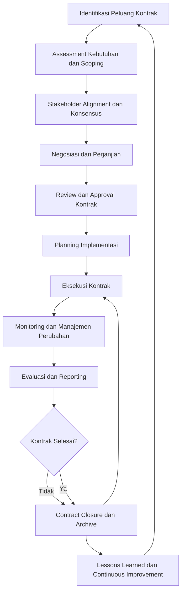

# INACRC-SOP-106 Manajemen Kontrak dan Kerjasama

## INFORMASI DOKUMEN

| Item | Keterangan |
|------|------------|
| **Judul** | Standard Operating Procedure (SOP) Manajemen Kontrak dan Kerjasama |
| **No. Dokumen** | INACRC-SOP-EXTERNAL-106-2025 |
| **Versi** | 1.0 |
| **Tanggal Berlaku** | 01 Desember 2025 |
| **Tanggal Review** | 01 Juni 2026 |
| **Tingkat Kerahasiaan** | Internal |
| **Lampiran** | 7 lampiran |
| **Ditetapkan oleh** | Kepala INA-CRC |
| **Disetujui oleh** | Direktur BB Binomika |
| **Dikendalikan oleh** | Unit Manajemen Mutu INA-CRC |

## DAFTAR PERUBAHAN

| Versi | Tanggal | Perubahan | Paraf |
|-------|---------|-----------|-------|
| 1.0 | 27 Nov 2025 | Pembuatan SOP awal | Draft |

## 1. TUJUAN

### 1.1 Tujuan Utama
SOP ini bertujuan untuk:
- Menstandarkan proses manajemen kontrak dan kerjasama untuk operasional INA-CRC
- Memastikan kepatuhan terhadap regulasi kontrak dan ketentuan kerjasama
- Mengoptimalkan nilai dan efisiensi dari setiap kontrak dan kemitraan
- Melindungi kepentingan INA-CRC dan stakeholders dalam setiap perjanjian

### 1.2 Tujuan Spesifik
- Menyediakan framework sistematis untuk identifikasi, negosiasi, dan implementasi kontrak
- Mengatur proses review dan approval kontrak secara konsisten dan terdokumentasi
- Menetapkan mekanisme monitoring dan evaluasi pelaksanaan kontrak
- Membangun sistem untuk manajemen konflik dan resolusi perselisihan

## 2. RUANG LINGKUP

### 2.1 Aplikasi
SOP ini berlaku untuk:
- Semua jenis kontrak yang melibatkan INA-CRC sebagai pihak atau fasilitator
- Kerjasama dengan sponsor, Clinical Research Units (CRUs), CROs, dan mitra strategis
- Perjanjian dengan institusi pendidikan, lembaga penelitian, dan organisasi terkait
- Kontrak dukungan teknis, layanan profesional, dan konsultasi

### 2.2 Jenis Kontrak
- **Kontrak Uji Klinis**: Perjanjian antara sponsor dan CRU untuk pelaksanaan uji klinis
- **Clinical Trial Agreement (CTA)**: Perjanjian formal yang mengatur hak dan kewajiban pihak
- **Memorandum of Understanding (MoU)**: Kesepakatan awal untuk kolaborasi
- **Material Transfer Agreement (MTA)**: Perjanjian pengiriman material biologis dan data
- **Confidentiality Agreement (CA)**: Perjanjian kerahasiaan informasi
- **Service Level Agreement (SLA)**: Perjanjian tingkat layanan dengan mitra
- **Letter of Intent (LoI)**: Surat niatan untuk kerjasama masa depan

### 2.3 Pengecualian
SOP ini tidak berlaku untuk:
- Kontrak personal individual yang tidak terkait operasional INA-CRC
- Perjanjian internal antar unit kerja yang diatur secara khusus
- Kontrak pengadaan barang dan jasa non-klinis yang diatur secara terpisah
- Perjanjian hibah dan donasi yang tidak melibatkan kewajiban timbal

## 3. REFERENSI

### 3.1 Regulasi Nasional
- Peraturan Pemerintah No. 54 Tahun 2018 tentang Pengadaan Barang/Jasa Pemerintah
- Undang-Undang No. 30 Tahun 1999 tentang Arbitrase dan Alternatif Penyelesaian Sengketa
- Undang-Undang No. 19 Tahun 2016 tentang Perubahan atas UU 30/1999
- Peraturan Presiden No. 16 Tahun 2018 tentang Pengadaan Barang/Jasa Pemerintah
- Peraturan Menteri Keuangan No. 133/PMK.02/2018 tentang Standar Biaya Masukan
- Peraturan Lembaga Kebijakan Pengadaan Barang/Jasa Pemerintah No. 8 Tahun 2018

### 3.2 Standar Internasional
- ICH-GCP E6(R2) Guidelines - Section 8.2 Contract Research Agreement
- WHO Guidelines for Clinical Trial Contracts and Agreements
- ISO 9001:2015 Clause 8.4 Control of Externally Provided Processes, Products, and Services
- PMI Standard for Contract Management
- International Federation of Pharmaceutical Manufacturers & Associations (IFPMA) Guidelines

### 3.3 Dokumen Terkait INA-CRC
- INACRC-SOP-MANAGEMENT-001: SOP Penyusunan Pembuatan SOP
- INACRC-SOP-QMS-002: SOP Manajemen Dokumen Terkendali
- INACRC-SOP-004: SOP Fasilitasi Negosiasi Clinical Trial Agreement (CTA)
- INACRC-SOP-007: SOP Pengajuan Persetujuan Material Transfer Agreement (MTA)
- INACRC-SOP-008: SOP Pelaporan dan Penutupan Uji Klinis
- INACRC-SOP-105: SOP Manajemen Stakeholder dan Komunikasi
- INACRC-SOP-103: SOP Manajemen Rapat Tim Kerja Internal

## 4. DEFINISI

### 4.1 Istilah Teknis
- **Kontrak**: Perjanjian yang mengikat secara hukum antara INA-CRC dan pihak ketiga
- **Kerjasama**: Hubungan kolaboratif dengan tujuan bersama tanpa kewajiban hukum formal
- **Sponsor**: Individu atau organisasi yang membiayai dan menginisiasi uji klinis
- **Principal Investigator (PI)**: Peneliti utama yang bertanggung jawab atas pelaksanaan uji klinis
- **Clinical Research Unit (CRU)**: Unit di fasilitas kesehatan yang melaksanakan uji klinis
- **Clinical Research Organization (CRO)**: Organisasi yang menyediakan layanan dukungan uji klinis
- **Site Initiation Visit (SIV)**: Kunjungan awal ke lokasi uji klinis sebelum pelaksanaan
- **Feasibility Study**: Studi kelayakan untuk mengidentifikasi kemampuan lokasi uji klinis
- **Budget Justification**: Pembenaran alokasi biaya berdasarkan kebutuhan aktual
- **Risk Mitigation**: Tindakan untuk mengurangi atau menghilangkan risiko kontrak
- **Deliverable**: Produk atau jasa yang harus diserahkan sesuai kontrak
- **Milestone**: Pencapaian signifikan dalam timeline kontrak
- **Key Performance Indicator (KPI)**: Metrik untuk mengukur kinerja kontrak
- **Scope Creep**: Perubahan tidak terkontrol yang menyebabkan biaya tambahan
- **Force Majeure**: Keadaan di luar kendali pihak yang membebaskan kewajiban kontrak

### 4.2 Singkatan
- SOP: Standard Operating Procedure
- CTA: Clinical Trial Agreement
- MTA: Material Transfer Agreement
- MoU: Memorandum of Understanding
- SLA: Service Level Agreement
- CA: Confidentiality Agreement
- LoI: Letter of Intent
- PI: Principal Investigator
- CRU: Clinical Research Unit
- CRO: Clinical Research Organization
- KPI: Key Performance Indicator

## 5. TANGGUNG JAWAB

### 5.1 Kepala INA-CRC
- Menyetujui kontrak dan kerjasama yang memiliki dampak strategis
- Memberikan arahan dalam negosiasi kontrak dengan stakeholder utama
- Menyetujui strategi manajemen risiko kontrak dan asuransi
- Menjadi penyetuju akhir untuk kontrak dengan nilai tinggi atau komprehensif
- Memastikan kepatuhan terhadap regulasi pengadaan dan hukum yang berlaku

### 5.2 Manajer Kontrak dan Kerjasama
- Memimpin pengembangan dan implementasi strategi kontrak
- Mengoordinasikan semua aktivitas manajemen kontrak dan kerjasama
- Melakukan review rutin terhadap performa kontrak dan kemitraan
- Mengidentifikasi risiko kontrak dan mengembangkan strategi mitigasi
- Menyiapkan laporan manajemen kontrak untuk manajemen senior

### 5.3 Koordinator Kontrak
- Mengelola administrasi kontrak dan kerjasama sehari-hari
- Melakukan tracking deadline dan deliverables kontrak
- Mengelola sistem monitoring dan evaluasi performa kontrak
- Menyiapkan dokumentasi kontrak untuk audit dan review
- Berkoordinasi dengan unit terkait untuk implementasi kontrak

### 5.4 Legal Officer
- Menyediakan review hukum terhadap draft kontrak dan perjanjian
- Memastikan kepatuhan terhadap regulasi dan standar hukum yang berlaku
- Memberikan pendapat hukum terhadap isu-isu kontrak dan perselisihan
- Mengelola proses arbitrase dan penyelesaian sengketa
- Memastikan perlindungan hak dan kepentingan hukum INA-CRC

### 5.1 Finance Officer
- Melakukan analisis keuangan terhadap proposal kontrak
- Mengembangkan anggaran dan alokasi biaya untuk kontrak
- Melakukan monitoring pengeluaran dan pendapatan terkait kontrak
- Memastikan kepatuhan terhadap standar keuangan dan pengadaan
- Menyiapkan laporan keuangan untuk evaluasi kontrak

### 5.6 Tim Review Kontrak
- Melakukan review teknis dan operasional terhadap draft kontrak
- Mengidentifikasi risiko, ketidakpastian, dan area perbaikan
- Memastikan konsistensi dengan regulasi dan kebijakan internal
- Memberikan rekomendasi perbaikan sebelum penandatanganan kontrak
- Melakukan tracking perubahan dan revisi kontrak

### 5.7 PI/CRU Representative
- Memberikan input teknis untuk perjanjian uji klinis
- Memastikan kesesuaian perjanjian dengan kapabilitas operasional
- Mengidentifikasi kebutuhan sumber daya dan dukungan untuk implementasi
- Melakukan negosiasi aspek teknis dan operasional dengan sponsor
- Memastikan kepatuhan terhadap GCP dan regulasi uji klinis

### 5.8 Sponsors/CRO Representatives
- Memberikan persyaratan teknis dan keuangan untuk kontrak
- Melakukan negosiasi harga dan jangka waktu dengan INA-CRC
- Menyediakan dokumentasi regulatory dan kepatuhan GCP
- Melakukan koordinasi implementasi uji klinis sesuai kontrak
- Memastikan kualitas data dan kepatuhan protokol penelitian

## 6. PROSEDUR

### 6.1 Identifikasi dan Inisiasi Kontrak

#### 6.1.1 Sourcing dan Identifikasi Peluang
1. **Pipeline Development**:
   - **Strategic Partnerships**: Kolaborasi dengan industri farmasi dan medis
   - **Academic Collaborations**: Kerjasama dengan universitas dan lembaga penelitian
   - **Government Programs**: Partisipasi dalam program kesehatan nasional
   - **International Opportunities**: Kerjasama dengan organisasi internasional

2. **Opportunity Assessment**:
   - **Strategic Alignment**: Evaluasi kesesuaian dengan mandate INA-CRC
   - **Resource Requirements**: Identifikasi kebutuhan sumber daya dan kapabilitas
   - **Financial Viability**: Analisis keuntungan dan biaya implementasi
   - **Risk Assessment**: Evaluasi risiko operasional dan reputasi
   - **Regulatory Compliance**: Memastikan kepatuhan dengan semua regulasi

3. **Initial Contact**:
   - **Formal Inquiry**: Kontak formal melalui email atau surat resmi
   - **Information Exchange**: Pertukaran informasi awal tentang kebutuhan dan kemampuan
   - **Confidentiality Agreement**: Penandatanganan NDA untuk diskusi rahasia
   - **Pre-meeting Preparation**: Persiapan agenda dan materi untuk diskusi awal

#### 6.1.2 Needs Assessment dan Scoping
1. **Requirement Gathering**:
   - **Stakeholder Analysis**: Identifikasi kebutuhan dan ekspektasi semua pihak
   - **Technical Requirements**: Spesifikasi teknis dan operasional yang diperlukan
   - **Regulatory Requirements**: Identifikasi persyaratan regulasi yang harus dipenuhi
   - **Timeline Requirements**: Penentuan jangka waktu dan deadline implementasi
   - **Quality Requirements**: Standar kualitas dan metrik evaluasi

2. **Scope Definition**:
   - **Deliverable Specification**: Definisi produk atau jasa yang akan diserahkan
   - **Responsibility Matrix**: Pembaguan tugas dan tanggung jawab yang jelas
   - **Performance Metrics**: Penentuan KPIs dan SLAs untuk evaluasi
   - **Risk Allocation**: Pembagian risiko antara pihak yang terlibat
   - **Change Management**: Prosedur untuk perubahan scope dan requirements

3. **Feasibility Analysis**:
   - **Resource Assessment**: Evaluasi ketersediaan dan alokasi sumber daya
   - **Technical Feasibility**: Analisis kemampuan teknis dan operasional
   - **Financial Analysis**: Perhitungan biaya-biaya dan return on investment
   - **Timeline Analysis**: Evaluasi jangka waktu yang realistis untuk implementasi
   - **Risk Analysis**: Identifikasi dan kuantifikasi risiko potensial

#### 6.1.3 Stakeholder Alignment
1. **Internal Consensus**:
   - **Management Approval**: Mendapatkan persetujuan dari manajemen senior
   - **Technical Review**: Review teknis dari ahli dan unit terkait
   - **Financial Review**: Evaluasi implikasi keuangan dan anggaran
   - **Legal Review**: Validasi dari unit hukum dan kepatuhan
   - **Regulatory Review**: Verifikasi kepatuhan terhadap regulasi yang berlaku

2. **External Agreement**:
   - **Stakeholder Commitment**: Memastikan komitmen dari pihak eksternal
   - **Terms Negotiation**: Negosiasi syarat dan kondisi yang menguntungkan
   - **Mutual Understanding**: Kesepakatan bersama tentang tujuan dan ekspektasi
   - **Documentation Commitment**: Kesepakatan untuk dokumentasi dan komunikasi
   - **Conflict Resolution**: Agreement pada mekanisme resolusi perselisihan

### 6.2 Negosiasi dan Perjanjian Kontrak

#### 6.2.1 Strategi Negosiasi
1. **Preparation Phase**:
   - **Market Research**: Analisis pasar dan benchmark harga
   - **BATNA Analysis**: Best Alternative to a Negotiated Agreement
   - **Negotiation Strategy**: Pengembangan strategi dan taktik negosiasi
   - **Team Formation**: Pembentukan tim negosiasi dengan peran yang jelas
   - **Documentation Preparation**: Persiapan dokumen pendukung dan template kontrak

2. **Negotiation Execution**:
   - **Opening Statement**: Penyampaian posisi awal dan tujuan negosiasi
   - **Interest-Based Bargaining**: Fokus pada kepentingan bersama dan solusi kreatif
   - **Value Maximization**: Optimasi nilai untuk semua pihak yang terlibat
   - **Risk Management**: Identifikasi dan mitigasi risiko negosiasi
   - **Progress Documentation**: Dokumentasi semua perubahan dan kesepakatan

3. **Technical Negotiation**:
   - **Scope Definition**: Negosiasi ruang lingkup dan deliverables yang jelas
   - **Performance Standards**: Penentuan standar kualitas dan metrik evaluasi
   - **Timeline Negotiation**: Negosiasi jangka waktu dan milestone
   - **Resource Allocation**: Negosiasi alokasi sumber daya dan biaya
   - **Quality Assurance**: Penentuan prosedur jaminan kualitas

#### 6.2.2 Perjanjian Kontrak
1. **Contract Structure**:
   - **Header Information**: Identifikasi pihak, tanggal, dan konteks kontrak
   - **Recitals**: Latar belakang dan tujuan pembentukan kontrak
   - **Definitions**: Definisi istilah teknis yang digunakan dalam kontrak
   - **Scope of Work**: Ruang lingkup pekerjaan atau layanan yang akan disediakan
   - **Contract Term**: Jangka waktu dan periode berlakunya kontrak

2. **Financial Terms**:
   - **Payment Schedule**: Jadwal dan metode pembayaran
   - **Pricing Structure**: Struktur harga dan biaya terkait
   - **Currency and Taxes**: Mata uang dan penanganan pajak
   - **Penalties and Bonuses**: Kondisi sanksi dan insentif
   - **Cost Allocation**: Pembagian biaya antara pihak yang terlibat

3. **Obligations dan Rights**:
   - **Obligations**: Kewajiban setiap pihak sesuai kontrak
   - **Rights**: Hak setiap pihak yang diperoleh melalui kontrak
   - **Intellectual Property**: Kepemilikan dan penggunaan hasil intelektual
   - **Confidentiality**: Kewajiban kerahasiaan informasi
   - **Termination**: Kondisi dan prosedur pengakhiran kontrak

#### 6.2.3 Review dan Approval
1. **Technical Review**:
   - **Scope Validation**: Verifikasi kelengkapan dan kejelasan ruang lingkup
   - **Feasibility Assessment**: Evaluasi kelayakan implementasi teknis dan operasional
   - **Risk Analysis**: Identifikasi risiko teknis dan operasional
   - **Resource Planning**: Perencanaan alokasi sumber daya yang diperlukan
   - **Timeline Review**: Evaluasi jangka waktu yang realistis

2. **Legal Review**:
   - **Regulatory Compliance**: Verifikasi kepatuhan terhadap regulasi yang berlaku
   - **Risk Assessment**: Analisis risiko hukum dan liabilitas
   - **Contract Validity**: Validasi legalitas dan kekuatan hukum kontrak
   - **Dispute Resolution**: Review klausul resolusi sengketa
   - **Compliance Requirements**: Identifikasi kepatuhan terhadap standar industri

3. **Management Approval**:
   - **Financial Approval**: Persetujuan dari unit keuangan dan PPW
   - **Strategic Alignment**: Verifikasi kesesuaian dengan strategi organisasi
   - **Risk Acceptance**: Persetujuan terhadap tingkat risiko yang dapat diterima
   - **Resource Commitment**: Komitmen alokasi sumber daya yang diperlukan
   - **Final Approval**: Persetujuan akhir sebelum penandatanganan

### 6.3 Implementasi dan Monitoring Kontrak

#### 6.3.1 Planning Implementasi
1. **Project Kick-off**:
   - **Team Formation**: Pembentukan tim implementasi dengan peran yang jelas
   - **Communication Plan**: Rencana komunikasi dengan semua stakeholders
   - **Resource Allocation**: Alokasi sumber daya, anggaran, dan fasilitas
   - **Timeline Development**: Penyusunan jadwal implementasi detail
   - **Risk Management**: Identifikasi dan mitigasi risiko implementasi

2. **Implementation Planning**:
   - **Work Breakdown**: Pecah pekerjaan menjadi tugas-tugas yang terukur
   - **Milestone Definition**: Penentuan milestone dan deliverables
   - **Resource Planning**: Perencanaan kebutuhan sumber daya per fase
   - **Quality Planning**: Perencanaan jaminan kualitas dan pengujian
   - **Contingency Planning**: Perencanaan solusi alternatif untuk masalah

3. **Coordination Setup**:
   - **Stakeholder Management**: Pengelolaan hubungan dengan semua pihak terlibat
   - **Communication Channels**: Penyiapan saluran komunikasi yang efektif
   - **Reporting Structure**: Struktur laporan dan eskalasi isu
   - **Meeting Schedule**: Penjadwalan rapat rutin dan review progress
   - **Documentation System**: Sistem untuk dokumentasi dan knowledge sharing

#### 6.3.2 Eksekusi Kontrak
1. **Operational Management**:
   - **Day-to-Day Coordination**: Koordinasi operasional harian dengan pihak terlibat
   - **Progress Tracking**: Monitoring kemajuan terhadap milestone dan deliverables
   - **Issue Management**: Identifikasi dan penyelesaian masalah operasional
   - **Quality Control**: Implementasi prosedur jaminan kualitas
   - **Change Management**: Pengelolaan perubahan yang terjadi selama implementasi

2. **Performance Monitoring**:
   - **KPI Tracking**: Pemantauan KPI dan metrik performa yang ditetapkan
   - **Milestone Assessment**: Evaluasi pencapaian milestone sesuai jadwal
   - **Quality Metrics**: Pengukuran kualitas hasil dan kepatuhan standar
   - **Budget Monitoring**: Monitoring penggunaan anggaran dan biaya aktual
   - **Risk Monitoring**: Pemantauan risiko yang teridentifikasi dan mitigasi

3. **Stakeholder Communication**:
   - **Regular Updates**: Laporan progress terjadwal kepada stakeholders
   - **Issue Reporting**: Pelaporan masalah dan kendala yang timbul
   - **Documentation Sharing**: Berbagi dokumentasi dan informasi yang relevan
   - **Feedback Collection**: Pengumpulan feedback dan evaluasi dari stakeholders
   - **Relationship Management**: Pengelolaan hubungan profesional dengan pihak terlibat

#### 6.3.3 Manajemen Perubahan
1. **Change Request Process**:
   - **Change Identification**: Identifikasi kebutuhan perubahan scope atau requirements
   - **Impact Assessment**: Analisis dampak perubahan terhadap biaya, jadwal, dan kualitas
   - **Formal Request**: Pengajuan perubahan secara formal dengan justifikasi
   - **Approval Process**: Proses review dan approval perubahan dari pihak terkait
   - **Documentation**: Dokumentasi semua perubahan dan persetujuan

2. **Scope Management**:
   - **Scope Validation**: Verifikasi bahwa perubahan sejalan dengan tujuan asli
   - **Change Control**: Kontrol implementasi perubahan yang disetujui
   - **Baseline Management**: Pengelolaan baseline kontrak untuk referensi
   - **Communication**: Komunikasi perubahan kepada semua stakeholders terpengaruh
   - **Risk Assessment**: Evaluasi risiko tambahan dari perubahan

3. **Contract Amendments**:
   - **Formal Amendment**: Perubahan kontrak secara formal dan tertulis
   - **Legal Review**: Review hukum terhadap amendemen kontrak
   - **Negotiation**: Negosiasi syarat baru untuk perubahan
   - **Documentation**: Dokumentasi lengkap amendemen dan justifikasi
   - **Approval Process**: Proses approval dari pihak dengan wewenang yang sesuai

### 6.4 Evaluasi dan Reporting Kontrak

#### 6.4.1 Performance Evaluation
1. **Quantitative Metrics**:
   - **Timeliness**: Pengukuran ketepatan waktu delivery terhadap jadwal
   - **Quality**: Penilaian kualitas deliverables terhadap standar
   - **Cost Performance**: Perbandingan biaya aktual dengan anggaran
   - **Compliance Rate**: Persentase kepatuhan terhadap persyaratan kontrak
   - **Stakeholder Satisfaction**: Tingkat kepuasan stakeholders terhadap hasil

2. **Qualitative Assessment**:
   - **Relationship Quality**: Kualitas hubungan profesional dan komunikasi
   - **Problem Resolution**: Efektivitas penyelesaian masalah yang timbul
   - **Innovation Value**: Kontribusi inovasi dan perbaikan proses
   - **Knowledge Transfer**: Efektivitas transfer pengetahuan dan best practices
   - **Strategic Alignment**: Kesesuaian hasil dengan tujuan strategis organisasi

3. **Evaluation Framework**:
   - **Regular Assessment**: Evaluasi berkala setiap kuartal atau semester
   - **Balanced Scorecard**: Metrik seimbang antara keuangan, kualitas, dan waktu
   - **Benchmarking**: Perbandingan dengan standar industri dan best practices
   - **Continuous Improvement**: Identifikasi area perbaikan dan implementasi
   - **Learning Documentation**: Dokumentasi pelajaran dan best practices

#### 6.4.2 Financial Reporting
1. **Revenue Recognition**:
   - **Milestone Billing**: Penagihan berdasarkan pencapaian milestone
   - **Expense Tracking**: Pencatatan semua pengeluaran terkait kontrak
   - **Profitability Analysis**: Analisis profitabilitas per kontrak dan portofolio
   - **Revenue Forecasting**: Proyeksi pendapatan berdasarkan pipeline kontrak
   - **Cash Flow Management**: Manajemen arus kas untuk operasional

2. **Budget Management**:
   - **Budget Allocation**: Alokasi anggaran per kontrak dan aktivitas
   - **Cost Control**: Kontrol biaya aktual terhadap anggaran yang disetujui
   - **Variance Analysis**: Analisis selisih antara anggaran dan aktual
   - **Reporting**: Laporan keuangan berkala kepada manajemen
   - **Audit Trail**: Dokumentasi semua transaksi dan perubahan anggaran

3. **Financial Compliance**:
   - **Tax Compliance**: Kepatuhan terhadap peraturan perpajakan
   - **Reporting Requirements**: Pemenuhan persyaratan laporan keuangan
   - **Audit Readiness**: Kesiapan untuk audit keuangan internal dan eksternal
   - **Internal Controls**: Kontrol internal untuk pencegahan fraud dan kesalahan
   - **Financial Policies**: Kepatuhan terhadap kebijakan keuangan organisasi

#### 6.4.3 Contract Closure
1. **Completion Assessment**:
   - **Deliverable Verification**: Verifikasi semua deliverables telah diserahkan
   - **Quality Acceptance**: Penerimaan hasil oleh stakeholders dengan kualitas yang memuaskan
   - **Final Payment**: Penyelesaian semua pembayaran sesuai kontrak
   - **Documentation Completion**: Finalisasi semua dokumentasi kontrak
   - **Lessons Learned**: Dokumentasi pelajaran dan rekomendasi perbaikan

2. **Archive Management**:
   - **Document Archiving**: Penyimpanan semua dokumen kontrak sesuai retensi
   - **Financial Records**: Arsip catatan keuangan terkait kontrak
   - **Communication Records**: Penyimpanan riwayat komunikasi penting
   - **Performance Data**: Penyimpanan data performa dan evaluasi
   - **Knowledge Base**: Pengembangan database pengetahuan dan best practices

3. **Success Celebration**:
   - **Achievement Recognition**: Pengakuan pencapaian tim dan individu
   - **Stakeholder Appreciation**: Apresiasi terhadap kontribusi stakeholders
   - **Knowledge Sharing**: Berbagi pelajaran dan best practices dengan organisasi
   - **Relationship Maintenance**: Pemeliharaan hubungan untuk kerjasama masa depan
   - **Strategic Planning**: Perencanaan berdasarkan keberhasilan dan pelajaran

## 7. ALIR KERJA

### 7.1 Alir Kerja Manajemen Kontrak

### 7.2 Timeline Manajemen Kontrak

| Aktivitas | Timeline | PIC | Output |
|-----------|----------|-----|--------|
| Identifikasi Peluang | 1-3 minggu | Manajer Kontrak | Pipeline kontrak |
| Assessment Scoping | 1-2 minggu | Tim Review Kontrak | Kelayakan dan scoping |
| Stakeholder Alignment | 1-2 minggu | Manajer Kontrak | Konsensus internal dan eksternal |
| Negosiasi Kontrak | 2-4 minggu | Tim Negosiasi | Draft kontrak siap review |
| Review Approval | 1-2 minggu | Legal Officer | Kontrak disetujui |
| Planning Implementasi | 1 minggu | Koordinator Kontrak | Rencana implementasi |
| Eksekusi Kontrak | Sesuai kontrak | Tim Implementasi | Deliverables selesai |
| Monitoring Evaluasi | Berkelanjutan | Koordinator Kontrak | Laporan performa |
| Closure Archive | 1 minggu | Manajer Kontrak | Dokumen lengkap |

## 8. RECORD DAN DOKUMENTASI

### 8.1 Record Kontrak
1. **Master Contract Register**:
   - Unique contract ID dan informasi pengidentifikasian
   - Tipe kontrak dan kategori
   - Pihak terlibat dan informasi kontak
   - Nilai kontrak dan durasi
   - Status kontrak (pipeline, aktif, selesai)

2. **Contract Documentation**:
   - Draft kontrak dan revisi
   - Perjanjian resmi yang ditandatangani
   - Amandemen kontrak dan addendum
   - Dokumen pendukung dan lampiran
   - Bukti persetujuan dan komunikasi

3. **Financial Records**:
   - Anggaran kontrak dan alokasi biaya
   - Invoices dan pembayaran yang terkait
   - Laporan keuangan dan analisis profitabilitas
   - Dokumen pengeluaran dan justifikasi
   - Audit trail transaksi keuangan

### 8.2 Performance Records
1. **Performance Metrics**:
   - KPIs dan target performa yang ditetapkan
   - Data performa aktual versus target
   - Analisis tren dan pola performa
   - Evaluasi kualitas dan kepuasan stakeholder
   - Benchmarking terhadap standar industri

2. **Stakeholder Documentation**:
   - Riwayat komunikasi dengan stakeholders
   - Feedback dan evaluasi dari stakeholders
   - Issue logs dan resolusi masalah
   - Meeting minutes dan keputusan penting
   - Relationship assessment dan development

3. **Audit Trail**:
   - Log aktivitas perubahan kontrak
   - Records approval dan keputusan
   - Documentation evidence untuk semua perubahan
   - Risk assessment dan mitigasi activities
   - Lessons learned dan best practices

### 8.3 Retensi Record
- **Master Contract Register**: 10 tahun
- **Kontrak Aktif**: 10 tahun
- **Kontrak Selesai**: 7 tahun
- **Financial Records**: 7 tahun
- **Performance Records**: 5 tahun
- **Stakeholder Documentation**: 5 tahun
- **Audit Trail**: 7 tahun
- **Lessons Learned**: Selamanya (knowledge base)

## 9. KPI DAN MONITORING

### 9.1 Key Performance Indicators
1. **Contract Acquisition**:
   - Number of contracts identified per quarter: Target ≥ 5
   - Contract conversion rate: Target ≥ 60%
   - Average contract value: Target ≥ Rp 500 juta
   - Time from identification to signing: Target ≤ 90 hari

2. **Financial Performance**:
   - Budget accuracy: Target ≤ 10% variance
   - Profit margin per contract: Target ≥ 15%
   - Payment collection rate: Target ≥ 95% on time
   - Cost efficiency: Target ≥ 90% budget utilization

3. **Operational Efficiency**:
   - Contract implementation time: Target ≤ 110% of planned
   - Change request processing time: Target ≤ 14 hari
   - Issue resolution time: Target ≤ 7 hari
   - Stakeholder satisfaction rate: Target ≥ 4.2/5.0

### 9.2 Monitoring dan Evaluasi
- Dashboard kontrak dan kerjasama dengan KPIs real-time
- Bulanan performance review dengan analysis tren
- Kuartalan stakeholder satisfaction survey
- Tahunan strategic review dan benchmarking
- Continuous improvement cycle dengan lessons learned integration

## 10. PENANGANAN DEVIASI DAN KONTINGENSI

### 10.1 Jenis Deviasi
1. **Contract Performance Issues**:
   - Keterlambatan deliverable atau milestone
   - Kualitas deliverables tidak memenuhi standar
   - Biaya melampaui anggaran yang disetujui
   - Ketidakpatuhan terhadap syarat dan ketentuan kontrak

2. **Negotiation Problems**:
   - Deadlock dalam negosiasi atau perselisihan
   - Ketidaksesuaian ekspektasi antara pihak
   - Perubahan syarat yang tidak disepakati
   - Informasi tidak lengkap atau tidak akurat

3. **Management Failures**:
   - Koordinasi yang tidak efektif antar stakeholders
   - Kegagalan dalam monitoring dan identifikasi masalah
   - Dokumentasi yang tidak lengkap atau tidak akurat
   - Respon yang tidak tepat waktu terhadap isu

### 10.2 Prosedur Penanganan
1. **Immediate Assessment**:
   - Identifikasi scope dan dampak deviasi
   - Evaluasi urgensi dan tingkat dampak
   - Notifikasi stakeholders terpengaruh
   - Implementasi sementara untuk mitigasi dampak

2. **Root Cause Analysis**:
   - Investigasi penyebab mendasar deviasi
   - Analisis proses yang gagal atau tidak efektif
   - Identifikasi area perbaikan sistematis
   - Pengembangan solusi preventif

3. **Corrective Actions**:
   - Implementasi tindakan korektif yang tepat waktu
   - Perbaikan proses untuk mencegah rekurensi
   - Training tambahan untuk tim yang terlibat
   - Review dan update prosedur operasional

4. **Escalation Procedures**:
   - Proses eskalasi untuk masalah yang tidak dapat diselesaikan
   - Notifikasi manajemen senior untuk isu signifikan
   - Intervensi dari pihak ketiga atau mediator jika diperlukan
   - Dokumentasi lengkap proses penyelesaian

## 11. LAMPIRAN

### Lampiran A: Template Kontrak dan Kerjasama
[Template standar untuk berbagai jenis kontrak dengan klausul yang dapat disesuaikan]

### Lampiran B: Checklist Review Kontrak
[Checklist komprehensif untuk review teknis, legal, dan keuangan kontrak]

### Lampiran C: KPI Dashboard Template
[Template dashboard untuk monitoring real-time performa kontrak dan kerjasama]

### Lampiran D: Risk Assessment Matrix
[Matrix untuk identifikasi, evaluasi, dan mitigasi risiko kontrak]

### Lampiran E: Stakeholder Management Tools
[Tools untuk identifikasi stakeholder, komunikasi, dan manajemen hubungan]

### Lampiran F: Financial Management Templates
[Template untuk anggaran, monitoring biaya, dan analisis keuangan kontrak]

### Lampiran G: Change Management Process
[Prosedur formal untuk manajemen perubahan scope, timeline, dan biaya kontrak]

---

**Dokumen ini dikendalikan sebagai dokumen terkendali INA-CRC. Salinan tidak terkendali tidak digunakan untuk operasional.**

**Untuk informasi lebih lanjut mengenai dokumen ini, hubungi:**
**Unit Manajemen Mutu INA-CRC**
**Email: quality@ina-crc.go.id**
**Website: www.ina-crc.go.id**