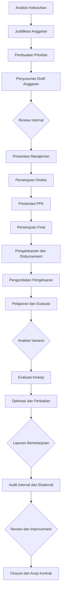

# INACRC-SOP-107 Manajemen Budget dan Keuangan

## INFORMASI DOKUMEN

| Item | Keterangan |
|------|------------|
| **Judul** | Standard Operating Procedure (SOP) Manajemen Budget dan Keuangan |
| **No. Dokumen** | INACRC-SOP-EXTERNAL-107-2025 |
| **Versi** | 1.0 |
| **Tanggal Berlaku** | 01 Desember 2025 |
| **Tanggal Review** | 01 Juni 2026 |
| **Tingkat Kerahasiaan** | Internal |
| **Lampiran** | 6 lampiran |
| **Ditetapkan oleh** | Kepala INA-CRC |
| **Disetujui oleh** | Direktur BB Binomika |
| **Dikendalikan oleh** | Unit Manajemen Mutu INA-CRC |

## DAFTAR PERUBAHAN

| Versi | Tanggal | Perubahan | Paraf |
|-------|---------|-----------|-------|
| 1.0 | 27 Nov 2025 | Pembuatan SOP awal | Draft |

## 1. TUJUAN

### 1.1 Tujuan Utama
SOP ini bertujuan untuk:
- Menstandarkan proses perencanaan, alokasi, pengendalian, dan pelaporan anggaran untuk operasional INA-CRC
- Memastikan penggunaan sumber daya keuangan yang efisien, transparan, dan akuntabel
- Menjamin kepatuhan terhadap regulasi keuangan publik dan standar akuntabilitas
- Mengoptimalkan nilai investasi dan manfaat yang diperoleh dari setiap program kegiatan

### 1.2 Tujuan Spesifik
- Menyediakan framework sistematis untuk budget planning, execution, monitoring, dan reporting
- Mengatur proses pengajuan, review, dan approval anggaran sesuai kebutuhan operasional
- Mengimplementasikan sistem kontrol pengeluaran untuk meminimalkan pemborosan dan penyalahgunaan
- Membangun mekanisme evaluasi kinerja keuangan dan akuntabilitas penggunaan sumber daya

## 2. RUANG LINGKUP

### 2.1 Aplikasi
SOP ini berlaku untuk:
- Semua anggaran operasional dan program kegiatan INA-CRC
- Biaya pelaksanaan proyek dengan sumber dana dari APBN, RK, dan sumber lainnya
- Anggaran untuk pembinaan kapasitas, pelatihan, dan pengembangan jejaring
- Biaya operasional rutin termasuk gaji, honorarium, dan pengeluaran kegiatan

### 2.2 Tipe Anggaran
- **Anggaran Operasional Rutin**: Biaya tahunan untuk operasional harian
- **Anggaran Proyek**: Biaya untuk kegiatan proyek tertentu dengan timeline tertentu
- **Anggaran Pembinaan**: Biaya untuk program pembinaan kapasitas CRU dan pelatihan
- **Anggaran Investasi**: Biaya untuk pembelian aset, teknologi, dan infrastruktur
- **Anggaran Darurat**: Cadangan dana untuk kejadian tak terduga dan keadaan darurat

### 2.3 Pengecualian
SOP ini tidak berlaku untuk:
- Gaji dan tunjangan pribadi staff yang diatur dalam kebijakan personalia
- Anggaran personal atau individu yang tidak terkait kegiatan resmi INA-CRC
- Biaya yang ditanggung oleh sponsor atau pihak ketiga dalam konteks uji klinis

## 3. REFERENSI

### 3.1 Regulasi Nasional
- Undang-Undang No. 17 Tahun 2003 tentang Keuangan Negara
- Undang-Undang No. 39 Tahun 2008 tentang Perbendaharaan Keuangan
- Undang-Undang No. 17 Tahun 2003 tentang Keuangan Kementerian/Lembaga
- Peraturan Pemerintah No. 50 Tahun 2012 tentang Sistem Akuntabilitas Pelaksanaan Anggaran
- Peraturan Menteri Keuangan tentang Standar Akuntansi Pemerintah
- Peraturan Menteri Keuangan No. 144/PMK.2015 tentang Perubahan APBN

### 3.2 Standar Internasional
- International Public Sector Accounting Standards (IPSAS)
- Government Finance Statistics Manual (GFSM)
- OECD Budget Practices Handbook
- International Federation of Accountants (IFAC) Standards
- ISO 9001:2015 Clause 7.3 (Design and Development of Products and Services)

### 3.3 Dokumen Terkait INA-CRC
- INACRC-SOP-MANAGEMENT-001: SOP Penyusunan Pembuatan SOP
- INACRC-SOP-QMS-002: SOP Manajemen Dokumen Terkendali
- INACRC-SOP-106: SOP Manajemen Kontrak dan Kerjasama
- INACRC-SOP-203: Pemeliharaan dan Pembaruan Dashboard Kinerja
- INACRC-SOP-105: SOP Manajemen Stakeholder dan Komunikasi

## 4. DEFINISI

### 4.1 Istilah Teknis
- **Anggaran**: Rencana keuangan yang disetujui untuk periode tertentu
- **Budget Cycle**: Siklus tahunan perencanaan, implementasi, pelaporan, dan evaluasi anggaran
- **Budget Justification**: Alasan dan dasar yang mendukung pengajuan anggaran
- **Budget Allocation**: Penempatan sumber daya keuangan ke program atau kegiatan
- **Disbursement**: Proses pencairan dana anggaran sesuai dengan kebutuhan dan ketentuan
- **Expenditure Control**: Pengendalian dan pengawasan pengeluaran untuk memastikan efisiensi
- **Variance Analysis**: Analisis selisih antara anggaran yang disetujui dan realisasi
- **Budget Re-allocation**: Proses perpindahan anggaran antar program atau kegiatan
- **Financial Audit**: Pemeriksaan formal atas pengelolaan keuangan dan akuntabilitas

### 4.2 Singkatan
- SOP: Standard Operating Procedure
- APBN: Anggaran Pendapatan dan Belanja Negara
- RK: Rencana Kerja Pemerintah
- PMK: Peraturan Menteri Keuangan
- PPK: Pejabat Pembuat Komitmen Anggaran
- IPSAS: International Public Sector Accounting Standards
- IFAC: International Federation of Accountants
- KPI: Key Performance Indicator

## 5. TANGGUNG JAWAB

### 5.1 Kepala INA-CRC
- Menyetujui anggaran tahunan dan perubahan anggaran
- Memberikan arahan strategis untuk alokasi prioritas keuangan
- Menyetujui penggunaan cadangan dan re-alokasi anggaran
- Memberikan persetujuan akhir untuk laporan pertanggungjawaban dan evaluasi anggaran
- Melaporkan anggaran dan realisasi kepada stakeholders tingkat tinggi

### 5.2 Manajer Keuangan
- Mengkoordinasikan proses perencanaan dan implementasi anggaran
- Menyiapkan draft anggaran tahunan untuk review dan persetujuan
- Melakukan analisis kebutuhan dan alokasi sumber daya
- Memantau implementasi anggaran dan realisasi pengeluaran
- Mengidentifikasi potensi efisiensi dan penghematan biaya

### 5.3 Finance Officer
- Menyiapkan analisis kebutuhan dan perkiraan biaya
- Mengembangkan justifikasi anggaran yang komprehensif
- Melakukan monitoring real-time terhadap penggunaan anggaran
- Menyiapkan laporan penggunaan anggaran bulanan dan triwulanan
- Mengidentifikasi dan melaporkan variansi anggaran

### 5.4 Unit Kerja/Program
- Mengidentifikasi kebutuhan keuangan berdasarkan program dan kegiatan
- Menyiapkan justifikasi anggaran dan perkiraan biaya
- Mengembangkan rencana kerja dan anggaran detail
- Melaksanakan program sesuai anggaran yang disetujui
- Melaporkan progress dan penggunaan anggaran secara berkala

### 5.5 Procurement Officer
- Melakukan proses pengadaan barang dan jasa sesuai anggaran
- Mengimplementasikan sistem pengendalian biaya dan kompetisi
- Memastikan kepatuhan terhadap regulasi pengadaan barang/jasa pemerintah
- Melakukan evaluasi kinerja supplier dan penilaian harga kompetitif

### 5.6 Internal Auditor
- Melakukan audit internal atas pengelolaan keuangan dan akuntabilitas
- Memeriksa kepatuhan terhadap SOP dan regulasi keuangan
- Mengidentifikasi risiko penyalahgunaan dan kebocoran anggaran
- Memberikan rekomendasi perbaikan sistem dan prosedur

## 6. PROSEDUR

### 6.1 Perencanaan Anggaran

#### 6.1.1 Analisis Kebutuhan
1. **Pengumpulan Kebutuhan**:
   - Kebutuhan operasional tahunan berdasarkan target dan program kerja
   - Kebutuhan investasi untuk infrastruktur, teknologi, dan aset
   - Kebutuhan pembinaan kapasitas dan pelatihan
   - Kebutuhan tidak terduga dan kontinjensi darurat

2. **Justifikasi Kebutuhan**:
   - Analisis biaya-biaya untuk setiap kebutuhan
   - Perbandingkan dengan alternatif dan opsi yang lebih efisien
   - Identifikasi keuntungan dan dampak dari setiap investasi
   - Perbandingkan dengan benchmarks industri dan best practices

3. **Pembuatan Prioritas**:
   - **Prioritas 1 (Kritis)**: Kebutuhan esensial untuk kelangsungan operasional
   - **Prioritas 2 (Tinggi)**: Kebutuhan untuk peningkatan kualitas dan efisiensi
   - **Prioritas 3 (Menengah)**: Kebutuhan untuk perbaikan dan peningkatan
   - **Prioritas 4 (Rendah)**: Kebutuhan opsional atau dapat ditunda

4. **Timeline Development**:
   - Identifikasi jadwal pengajuan dan approval anggaran
   - Sinkronisasi dengan kalender fiskal dan program kerja
   - Perencanaan alokasi dana dan pengeluaran
   - Identifikasi milestone dan deliverables anggaran

#### 6.1.2 Penyusunan Draft Anggaran
1. **Struktur Anggaran**:
   - **Pendapatan**: Sumber dana dari APBN, RK, dana pinjaman, dan lainnya
   - **Belanja**: Kategori belanja menurut klasifikasi keuangan
   - **Program**: Kegiatan dan program yang akan dilaksanakan
   - **Target**: Sasaran kinerja yang akan dicapai
   - **Waktu**: Periode anggaran (tahunan atau periode proyek)

2. **Detail Komponen Anggaran**:
   - **Belanja Pegawai**: Gaji, tunjangan, dan kesejahteraan
   - **Belanja Barang**: Pengadaan aset, peralatan, dan operasional
   - **Belanja Modal**: Investasi dalam infrastruktur, teknologi, dan bangunan
   - **Belanja Jasa**: Biaya konsultasi, profesional, dan pihak ketiga
   - **Belanja Bunga**: Biaya bunga pinjaman dan utang
   - **Belanja Lainnya**: Biaya operasional lainnya

3. **Asumsi dan Estimasi**:
   - Asumsi inflasi dan kenaikan biaya yang realistis
   - Perkiraan pendapatan dan penerimaan berdasarkan historis
   - Proyeksi kebutuhan kas untuk operasional
   - Analisis sensitivitas terhadap variabel ekonomi

4. **Review Internal**:
   - Review oleh manajer keuangan dan unit kerja terkait
   - Validasi asumsi dan estimasi biaya
   - Penyesuaian berdasarkan feedback dan kapasitas fiskal
   - Konsistensi dengan program kerja dan target organisasi

#### 6.1.3 Presentasi dan Persetujuan
1. **Presentasi Manajemen**:
   - Presentasi rancangan anggaran kepada pimpinan INA-CRC
   - Highlight prioritas, kebutuhan kritis, dan alokasi sumber daya
   - Sampaikan analisis biaya-biaya dan justifikasi investasi
   - Diskusi alternatif dan trade-offs yang ada

2. **Persetujuan Direksi**:
   - Persetujuan dari manajemen senior dan PPK
   - Amandahan terhadap prioritas dan alokasi
   - Instruksi untuk penyesuaian dan perubahan rancangan
   - Penetapan timeline pengajuan dan approval formal

3. **Presentasi PPK**:
   - Presentasi final kepada Pejabat Pembuat Komitmen Anggaran
   - Persiapan untuk menjawab pertanyaan dan koreksi
   - Justifikasi komprehensif untuk setiap komponen anggaran
   - Penjelasan keterkaitan dengan program dan target

### 6.2 Implementasi dan Pengendalian

#### 6.2.1 Pengalokasian dan Disbursement
1. **Proses Approval**:
   - Review formal oleh PPK dan manajemen senior
   - Validasi kepatuhan terhadap regulasi dan standar keuangan
   - Amandahan jika diperlukan oleh stakeholders eksternal
   - Dokumentasi persetujuan dan amandemen resmi

2. **Disbursement Control**:
   - Sistem pencairan dana berdasarkan kebutuhan aktual
   - Proses otorisasi untuk pengeluaran atas Rp 100 juta
   - Implementasi validasi sebelum setiap pencairan
   - Monitoring real-time terhadap alokasi dan penggunaan

3. **Cash Management**:
   - Manajemen kas operasional untuk kebutuhan rutin
   - Proses otorisasi untuk pengeluaran kecil
   - Rekening bank terpisah untuk kebutuhan operasional dan investasi
   - Prosedur transfer dana antar rekening

4. **Budget Control System**:
   - Implementasi sistem informasi manajemen anggaran
   - Real-time tracking terhadap realisasi vs. anggaran
   - Otomatisasi notifikasi untuk limit pengeluaran
   - Integrasi dengan sistem keuangan kementerian

#### 6.2.2 Pengendalian Pengeluaran
1. **Pengendalian Rutin**:
   - Approval dua tingkat untuk pengeluaran di atas Rp 100 juta
   - Prosedur tender dan kontrak untuk pengadaan barang/jasa
   - Validasi harga dan kompetisi berdasarkan market benchmarks
   - Monitoring persetujuan dan implementasi kontrak

2. **Analisis Variansi**:
   - Perbandingan bulanan antara anggaran dan realisasi
   - Identifikasi penyebab variansi signifikan (>10%)
   - Analisis dampak terhadap kinerja program
   - Rekomendasi tindakan korektif dan preventif

3. **Penghematan Biaya**:
   - Program efisiensi operasional
   - Review kontrak vendor dan negosiasi perpanjangan
   - Optimasi alokasi sumber daya bersama
   - Implementasi teknologi untuk otomasi dan digitalisasi

4. **Anti-Korupsi**:
   - Segregasi fungsi approval dan pengeluaran untuk mencegah konflik kepentingan
   - Implementasi sistem whistle-blower untuk pelaporan penyimpangan
   - Random audit terhadap transaksi keuangan
   - Program kepatuhan etika dan integritas

### 6.3 Pelaporan dan Evaluasi

#### 6.3.1 Sistem Pelaporan
1. **Laporan Bulanan**:
   - Laporan realisasi anggaran vs. plan bulanan
   - Analisis variansi dan penyebab utama
   - Kinerja cash dan manajemen likuiditas
   - Perkiraan sisa anggaran untuk periode tersisa

2. **Laporan Triwulanan**:
   - Review kinerja anggaran per triwulan
   - Analisis trend pengeluaran dan alokasi sumber daya
   - Evaluasi efisiensi program dan kegiatan
   - Perkiraan kebutuhan anggaran untuk periode berikutnya

3. **Laporan Semesteran**:
   - Evaluasi komprehensif kinerja anggaran semesteran
   - Analisis pencapaian target dan sasaran program
   - Review kepatuhan terhadap regulasi dan standar keuangan
   - Rekomendasi perbaikan sistem dan prosedur

4. **Laporan Tahunan**:
   - Laporan pertanggungjawaban pelaksanaan anggaran tahunan
   - Analisis efisiensi penggunaan sumber daya keuangan
   - Evaluasi kinerja investasi dan pengembalian kapasitas
   - Rekomendasi perbaikan anggaran tahunan berikutnya

#### 6.3.2 Evaluasi Kinerja
1. **Budget Performance Indicators**:
   - **Realisasi Anggaran**: Persentase realisasi vs. anggaran yang disetujui
   - **Efisiensi Biaya**: Rasio output/input dan analisis efisiensi
   - **Tingkat Akurasi**: Deviasi perkiraan biaya vs. aktual
   - **Waktu Approval**: Rata-rata waktu dari pengajuan hingga persetujuan
   - **Compliance Rate**: Kepatuhan terhadap regulasi dan SOP keuangan

2. **Alokasi Efektivitas**:
   - **ROI (Return on Investment)**: Analisis return investasi program
   - **Cost-Benefit Analysis**: Perbandingan biaya dengan manfaat yang diperoleh
   - **Value for Money**: Evaluasi efisiensi pengeluaran dan pengadaan
   - **Benchmarking**: Perbandingan kinerja dengan standar industri dan best practices

3. **Stakeholder Satisfaction**:
   - Survey kepuasan sponsor dan mitra strategis
   - Feedback dari CRU dan stakeholder eksternal
   - Evaluasi kualitas layanan dan responsivitas
   - Indeks kepercayaan dan reputasi keuangan

## 7. ALIR KERJA

### 7.1 Alir Kerja Manajemen Budget dan Keuangan

### 7.2 Timeline Proses Manajemen Anggaran

| Fase | Waktu | Aktivitas Utama | Output |
|------|-------|----------------|--------|
| **1. Perencanaan** | 2 bulan | Analisis kebutuhan, justifikasi, draft anggaran | Rancangan anggaran |
| **2. Review Internal** | 2 minggu | Review manajerial dan teknis | Anggaran yang direvisi |
| **3. Presentasi Manajemen** | 1 minggu | Presentasi kepada pimpinan | Feedback dan arahan |
| **4. Persetujuan PPK** | 2 minggu | Presentasi dan proses persetujuan | Anggaran yang disetujui |
| **5. Implementasi** | 12 bulan | Eksekusi anggaran dan kegiatan | Realisasi program |
| **6. Monitoring** | Berkelanjutan | Pelaporan bulanan dan evaluasi | Laporan kinerja |
| **7. Evaluasi** | 1 bulan | Evaluasi akhir tahun anggaran | Laporan pertanggungjawaban |
| **8. Audit** | Berkala | Audit internal dan eksternal | Laporan audit dan rekomendasi |

## 8. RECORD DAN DOKUMENTASI

### 8.1 Record Anggaran
1. **Dokumen Perencanaan**:
   - Rancangan anggaran tahunan dan analisis kebutuhan
   - Justifikasi komprehensif dan perkiraan biaya
   - Prioritas dan alokasi sumber daya
   - Dokumen presentasi dan persetujuan

2. **Record Implementasi**:
   - Realisasi anggaran aktual vs. plan
   - Bukti pengeluaran dan pembayaran
   - Kontrak dan perjanjian dengan pihak ketiga
   - Laporan kinerja dan evaluasi program

3. **Record Evaluasi**:
   - Analisis variansi dan penyebab deviasi
   - Evaluasi ROI dan cost-benefit analysis
   - Rekomendasi perbaikan dan lessons learned
   - Feedback stakeholder dan kepuasan mitra

### 8.2 Retensi Record
- **Dokumen Anggaran**: 10 tahun
- **Realisasi Anggaran**: 10 tahun
- **Kontrak dan Perjanjian**: Selamanya (archive permanen)
- **Laporan Evaluasi**: 5 tahun
- **Audit Reports**: 5 tahun
- **Data Keuangan**: Selamanya (archive permanen untuk data sensitif)

## 9. KPI DAN MONITORING

### 9.1 Key Performance Indicators
1. **Efektivitas Anggaran**:
   - Persentase realisasi anggaran: Target ≥ 95%
   - Waktu approval anggaran: Target ≤ 30 hari kerja
   - Akurasi estimasi biaya: Target ≤ 10% deviasi
   - Kepatuhan regulasi keuangan: Target 100%

2. **Efisiensi Operasional**:
   - Ratio biaya admin terhadap total biaya: Target ≤ 5%
   - Waktu siklus pengadaan: Target ≤ 60 hari
   - Jumlah proses otomatis: Target ≥ 80% transaksi
   - Tingkat kepuasan stakeholder: Target ≥ 4.0/5.0

3. **Kualitas Keuangan**:
   - Tingkat akurasi pelaporan keuangan: Target ≥ 98%
   - Waktu closing laporan bulanan: Target ≤ 5 hari kerja
   - Jumlah audit tanpa temuan: Target ≥ 80%
   - Tingkat implementasi rekomendasi audit: Target ≥ 90%

4. **Integritas dan Kepatuhan**:
   - Jumlah laporan whistleblowing: Target ≥ 95% ditindaklanjuti
   - Tingkat kepatuhan tender: Target 100%
   - Jumlah konflik kepentingan teridentifikasi: Target ≤ 3 per tahun
   - Hasil audit eksternal: Target tanpa temuan material

### 9.2 Monitoring dan Evaluasi
- Dashboard real-time untuk monitoring kinerja anggaran
- Laporan bulanan kepada manajemen senior dan PPK
- Evaluasi triwulan dengan analisis trend dan perbaikan
- Survey kepuasan stakeholder setiap semester
- Audit internal berkala dan audit eksternal tahunan

## 10. PENANGANAN DEVIASI DAN KONTINGENSI

### 10.1 Jenis Deviasi
1. **Over Budget**:
   - Pengeluaran melebihi anggaran yang disetujui
   - Implementasi tanpa persetujuan formal
   - Penggunaan alokasi untuk kebutuhan tidak terencana

2. **Under Utilization**:
   - Realisasi anggaran jauh di bawah yang disetujui
   - Penundaan implementasi program prioritas
   - Sisa anggaran signifikan tanpa justifikasi

3. **Compliance Violations**:
   - Pelanggaran terhadap regulasi keuangan publik
   - Tidak kepatuhan terhadap standar akuntabilitas
   - Penyimpangan dalam proses tender dan pengadaan
   - Penggunaan dana untuk tujuan tidak sah

4. **Control Weakness**:
   - Sistem kontrol yang tidak efektif atau mudah dieksploitasi
   - Prosedur otorisasi yang tidak dijalankan dengan ketat
   - Pemalsuan dokumen keuangan yang tidak memadai standar

### 10.2 Prosedur Penanganan
1. **Immediate Response**:
   - Suspendi pengeluaran yang menyalahi aturan
   - Investigasi penyebab deviasi secara cepat
   - Koreksi tindakan dan implementasi kontrol perbaikan
   - Laporkan kepada pihak berwenang jika diperlukan

2. **Root Cause Analysis**:
   - Investigasi menyeluruh penyebab kegagalan sistem
   - Analisis kegagalan prosedur dan kebijakan yang ada
   - Evaluasi faktor manusia, sistem, dan eksternal
   - Identifikasi area perbaikan yang diperlukan

3. **Corrective Actions**:
   - Perbaikan sistem kontrol dan prosedur otorisasi
   - Training tambahan untuk staf keuangan
   - Implementasi sistem audit internal yang lebih kuat
   - Penguatan kebijakan anti-korupsi dan etika bisnis

4. **Preventive Measures**:
   - Update SOP berdasarkan lessons learned
   - Peningkatan teknis keuangan dan monitoring sistem
   - Program pelatihan berkala untuk staf keuangan
   - Implementasi sistem deteksi dini untuk anomali

5. **Reporting dan Disclosures**:
   - Laporkan semua deviasi material kepada manajemen senior
   - Disclose kegiatan yang melanggar hukum jika diperlukan
   - Dokumentasi proses investigasi dan tindakan korektif
   - Implementasi sistem pelaporan anonim untuk perlindungan whistleblower

## 11. LAMPIRAN

### Lampiran A: Template Justifikasi Anggaran
[Template komprehensif untuk justifikasi kebutuhan anggaran dengan analisis biaya-biaya, alternatif, dan rekomendasi]

### Lampiran B: Struktur Anggaran Standar
[Template struktur anggaran tahunan yang sesuai dengan klasifikasi keuangan pemerintah dan standar akuntabilitas]

### Lampiran C: Checklist Review Internal Anggaran
[Checklist komprehensif untuk review internal rancangan anggaran oleh manajemen dan unit kerja terkait]

### Lampiran D: Format Presentasi Anggaran
[Template presentasi profesional untuk manajemen dan PPK dengan highlight executive summary, analisis, dan rekomendasi]

### Lampiran E: Monitoring Dashboard Template
[Template dashboard monitoring real-time untuk kinerja anggaran dengan KPIs dan visualisasi]

### Lampiran F: Variansi Analysis Report
[Template analisis variansi bulanan dan triwulanan dengan identifikasi penyebab dan rekomendasi perbaikan]

---

**Dokumen ini dikendalikan sebagai dokumen terkendali INA-CRC. Salinan tidak terkendali tidak digunakan untuk operasional.**

**Untuk informasi lebih lanjut mengenai dokumen ini, hubungi:**
**Unit Manajemen Mutu INA-CRC**
**Email: quality@ina-crc.go.id**
**Website: www.ina-crc.go.id**