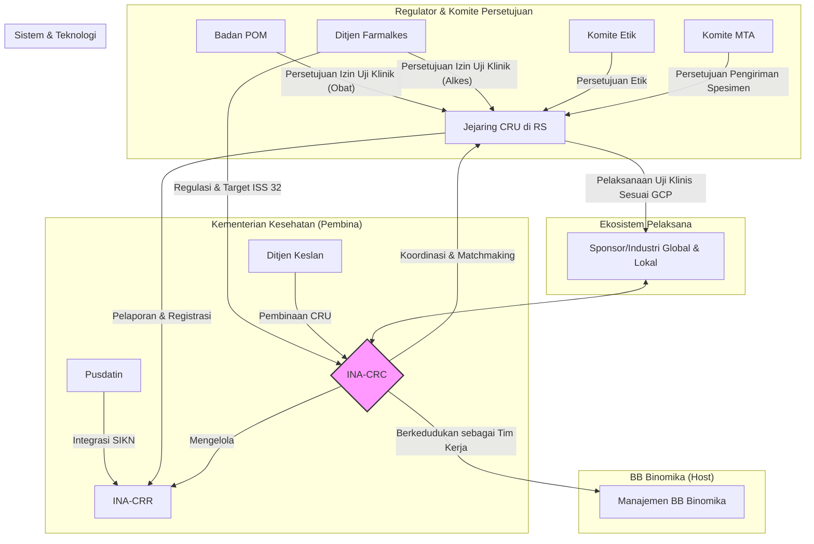

# Blueprint Strategis: Arsitektur Tata Kelola Uji Klinis Nasional INA-CRC

**Versi:** 1.1
**Tanggal:** 29 Oktober 2025

## 1. Visi dan Prinsip Panduan

*   **Visi:** Menjadikan Indonesia sebagai destinasi utama pelaksanaan uji klinis di Asia Tenggara melalui tata kelola yang terintegrasi, transparan, dan berstandar internasional.
*   **Misi:** Mengakselerasi inovasi kesehatan dengan menyelaraskan dan membina ekosistem uji klinis nasional untuk menghasilkan bukti ilmiah yang berkualitas.
*   **Prinsip Panduan:**
    *   **Kepatuhan (Compliance):** Semua proses berpegang pada standar *Good Clinical Practice* (GCP), regulasi nasional, dan prinsip etik.
    *   **Sentralisasi (Centralization):** INA-CRC bertindak sebagai *single entry point* dan koordinator utama untuk semua kegiatan uji klinis.
    *   **Transparansi (Transparency):** Alur kerja, status, dan hasil uji klinis dapat diakses melalui sistem terintegrasi (INA-CRR).
    *   **Kolaborasi (Collaboration):** Mendorong kerja sama yang erat antara regulator, industri/sponsor, akademisi, dan fasilitas kesehatan.
    *   **Pembinaan (Enablement):** Fokus pada peningkatan kapasitas dan kemandirian *Clinical Research Unit* (CRU) di seluruh Indonesia.

## 2. Arsitektur Organisasi dan Tata Kelola

Blueprint ini mendefinisikan INA-CRC sebagai pusat dari ekosistem uji klinis nasional, dengan struktur dan hubungan yang jelas.



*   **INA-CRC (Pusat):** Berfungsi sebagai **Tim Kerja** di bawah **BB Binomika**. Merupakan pusat koordinasi, fasilitator, dan *matchmaker*.
*   **Regulator & Pembina:**
    *   **Ditjen Farmalkes:** Menetapkan kebijakan, regulasi, bertanggung jawab atas target nasional (ISS 32), dan memberikan **izin uji klinis alat kesehatan**.
    *   **Badan POM:** Memberikan **izin uji klinis obat dan produk biologi lainnya**.
    *   **Ditjen Keslan:** Bertanggung jawab untuk membina dan meningkatkan kapasitas CRU di rumah sakit.
*   **Komite Persetujuan:**
    *   **Komite Etik:** Memberikan persetujuan etik penelitian setelah meninjau protokol.
    *   **Komite MTA:** Memberikan persetujuan untuk pengiriman spesimen biologis ke luar negeri.
*   **Pelaksana:**
    *   **Clinical Research Units (CRU):** Ujung tombak pelaksanaan uji klinis di rumah sakit, harus tersertifikasi GCP.
*   **Sponsor:** Industri farmasi, bioteknologi, atau lembaga riset (lokal/global) yang mendanai penelitian.

## 3. Arsitektur Proses Inti

Alur kerja utama dirancang untuk efisiensi dan transparansi, dengan INA-CRC sebagai gerbang utama.

| Tahap Proses | Aktor Utama | Deskripsi Aktivitas | Output Kunci |
| --- | --- | --- | --- |
| **1. Inisiasi & Pendaftaran** | Sponsor, INA-CRC | Sponsor mengajukan proposal uji klinis melalui *single entry point* INA-CRC. Proposal diregistrasikan di **INA-CRR**. | Proposal terdaftar dengan nomor unik |
| **2. Feasibility & Matchmaking** | INA-CRC, Sponsor, CRU | INA-CRC melakukan studi kelayakan (*feasibility study*) dan merekomendasikan CRU yang paling sesuai kepada sponsor. | Rekomendasi CRU, Hasil Feasibility Study |
| **3. Perjanjian & Persiapan** | Sponsor, CRU, INA-CRC | Negosiasi **Clinical Trial Agreement (CTA)** antara Sponsor dan CRU, difasilitasi oleh INA-CRC. Persiapan dokumen untuk persetujuan. | CTA ditandatangani, Dokumen pengajuan siap |
| **4. Persetujuan Regulasi & Etik** | CRU, Komite Etik, Badan POM/Farmalkes, Komite MTA | CRU mengajukan permohonan persetujuan secara paralel:<br>1. **Persetujuan Etik** ke Komite Etik.<br>2. **Izin Uji Klinis** ke Badan POM (obat) atau Ditjen Farmalkes (alkes).<br>3. **Persetujuan MTA** ke Komite MTA (jika ada pengiriman spesimen). | 1. Surat Persetujuan Etik<br>2. Izin Pelaksanaan Uji Klinik (PPUK)<br>3. Persetujuan MTA |
| **5. Pelaksanaan & Monitoring** | CRU, Sponsor | Setelah semua persetujuan diperoleh, CRU melaksanakan uji klinis sesuai protokol dan standar GCP. Sponsor (atau CRO) melakukan monitoring. | Data uji klinis, Laporan monitoring |
| **6. Pelaporan & Penutupan** | CRU, Sponsor, INA-CRC | Hasil uji klinis dilaporkan dan statusnya diperbarui di INA-CRR. Proyek ditutup secara resmi. | Laporan akhir studi, Publikasi, Data di INA-CRR |

## 4. Arsitektur Sistem dan Teknologi

Komponen teknologi mendukung proses bisnis untuk memastikan integrasi dan visibilitas data.

```mermaid
graph LR
    subgraph Eksternal
        A[Sistem Sponsor];
        B[SIKN - Pusdatin];
    end

    subgraph Platform INA-CRC
        C[Portal INA-CRC] --> D{Indonesia Clinical Research Registry (INA-CRR)};
        D -- API --> E[Dasbor Monitoring Kinerja];
        D -- API --> B;
        A -- API/Input Manual --> C;
    end

    subgraph Pengguna
        F[Sponsor] --> C;
        G[Publik] --> D;
        H[Manajemen Kemenkes] --> E;
        I[Tim INA-CRC] --> C;
        I --> D;
        I --> E;
    end
```

*   **Indonesia Clinical Research Registry (INA-CRR):** Database pusat yang menjadi sumber kebenaran tunggal (*single source of truth*) untuk semua uji klinis di Indonesia. Mencatat semua tahapan dari registrasi hingga hasil akhir.
*   **Portal INA-CRC:** Gerbang untuk sponsor melakukan pengajuan proposal dan bagi tim INA-CRC untuk mengelola alur kerja.
*   **Dasbor Monitoring Kinerja:** Alat bantu visual bagi manajemen Kemenkes dan INA-CRC untuk memantau metrik kunci seperti jumlah uji klinis aktif, waktu rekrutmen, dan pencapaian target ISS 32.
*   **Integrasi:** INA-CRR dirancang untuk dapat berinteraksi melalui API dengan Sistem Informasi Kesehatan Nasional (SIKN) untuk sinkronisasi data kesehatan yang lebih luas.

## 5. Peta Jalan Implementasi Strategis

Implementasi blueprint ini akan dilakukan secara bertahap untuk memastikan adopsi yang mulus dan mitigasi risiko.

| Fase                               | Fokus Utama                                                              | Jangka Waktu | Metrik Keberhasilan Utama                                                              |
| ---------------------------------- | ------------------------------------------------------------------------ | ------------ | -------------------------------------------------------------------------------------- |
| **Fase 1: Fondasi & Tata Kelola**  | - Pembentukan Tim Kerja INA-CRC secara resmi.<br>- Finalisasi SOP & alur kerja inti.<br>- Pengembangan prototipe INA-CRR & Dasbor. | 6 Bulan      | - SOP diadopsi.<br>- Tim Kerja beroperasi penuh.<br>- Prototipe INA-CRR berfungsi.          |
| **Fase 2: Implementasi & Penguatan INA-CRC**  | - Implementasi alur kerja pada Tim Kerja INA-CRC.<br>- Pelatihan intensif untuk Tim Kerja INA-CRC.<br>- Uji coba integrasi sistem. | 12 Bulan     | - Minimal 5 uji klinis berjalan melalui alur baru.<br>- Tim Kerja INA-CRC mampu memfasilitasi sertifikasi GCP. |
| **Fase 3: Eskalasi & Optimalisasi** | - Perluasan implementasi ke jejaring CRU yang lebih luas.<br>- Peluncuran penuh INA-CRR untuk publik.<br>- Harmonisasi kebijakan lintas sektor. | 24 Bulan+    | - Peningkatan jumlah uji klinis yang terdaftar.<br>- Peningkatan target ISS 32 tercapai. |
