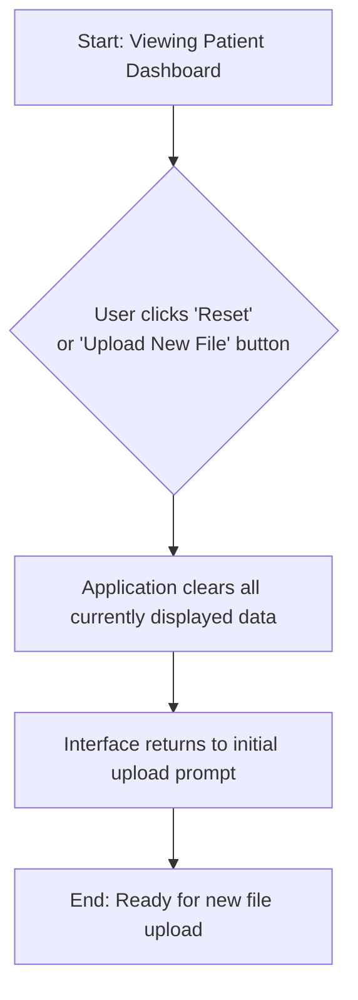

# FHIR Patient Record Visualizer - UI/UX Specification

### **1. Introduction**

This document defines the user experience goals, information architecture, user flows, and visual design specifications for the **FHIR Patient Record Visualizer**. It serves as the foundation for visual design and frontend development, ensuring a cohesive and user-centered experience.

#### **Overall UX Goals & Principles**

* **Target User Personas:**
    * **Primary: Clinicians:** Physicians, specialists, and nurses who need to rapidly understand a patient's medical status to make informed decisions.
    * **Secondary: Researchers & Students:** Individuals who need a simple tool to review synthetic patient records for academic or research purposes.
* **Usability Goals:**
    * **Efficiency of Use:** A clinician can upload a file and assess a patient's key health indicators (active conditions, allergies, current medications) in under 60 seconds.
    * **Error Prevention:** The interface should guide users to upload the correct file type and provide clear feedback.
    * **Clarity:** The data presentation must be unambiguous and instantly understandable to a medical professional.
* **Design Principles:**
    1.  **Clarity Over Cleverness:** Prioritize clear, direct data presentation over innovative but potentially confusing UI patterns.
    2.  **Information Hierarchy is Key:** The most critical clinical information (e.g., allergies, active problems) must be the most prominent.
    3.  **Data-Dense, Not Cluttered:** The design should present a comprehensive overview without overwhelming the user.
    4.  **Professional & Trustworthy:** The aesthetic should be clean and clinical, building user trust in the data's presentation.

### **2. Information Architecture (IA)**

#### **Site Map / Screen Inventory**

The application consists of one main screen, the **Patient Dashboard**, which is populated after a file is uploaded.

```mermaid
graph TD
    A[Application Entry] --> B(Patient Dashboard View);
    B --> C[Patient Header];
    B --> D[Conditions Card];
    B --> E[Allergies Card];
    B --> F[Medications Card];
    B --> G[Immunizations Card];
    B --> H[Procedures Card];
````

#### **Navigation Structure**

  * **Primary Navigation:** Not applicable. As a single-page tool, there is no primary navigation bar.
  * **User Flow:** The user journey is: **1. Upload File** → **2. View Dashboard** → **3. Scroll to View Data Cards** → **4. Reset/Upload New File**.

### **3. User Flows**

#### **Flow 1: Initial File Upload and Visualization**

  * **User Goal:** To upload a patient's FHIR JSON file and see their medical record summary.
  * **Entry Points:** The user arrives at the application's main page.
  * **Success Criteria:** The patient's data is successfully parsed and displayed on the dashboard.

**Flow Diagram:**

```mermaid
graph TD
    A[Start on Main Page] --> B{User clicks 'Upload File' <br> or drags file into dropzone};
    B --> C[System file picker opens];
    C --> D{User selects a valid .json file};
    D --> E[File content is loaded into memory];
    E --> F[Application parses FHIR resources];
    F --> G[Dashboard is populated with patient data];
    G --> H[End: User views patient record];
```

**Edge Cases & Error Handling:**

  * **Invalid File Type:** If a non-`.json` file is selected, show an error message.
  * **Invalid FHIR Data:** If the JSON is not a valid FHIR bundle, show an error message.

#### **Flow 2: Reset / Upload New File**

  * **User Goal:** To clear the current view and upload a new file.
  * **Entry Points:** The user is currently viewing a patient dashboard.
  * **Success Criteria:** The dashboard is cleared and the initial upload prompt is displayed.

**Flow Diagram:**



### **4. Wireframes & Mockups**

High-fidelity mockups will be created in a dedicated design tool (e.g., Figma). Text-based descriptions will guide the layout.

### **5. Component Library / Design System**

#### **Design System Approach**

A new, lightweight component library will be created for this application, focusing on clear data presentation.

#### **Core Components**

  * **Data Card:** A container for specific data categories (e.g., Conditions).
  * **Upload Component:** A button or drag-and-drop area for file selection.

### **6. Branding & Style Guide**

#### **Visual Identity**

The aesthetic will be professional, trustworthy, and clean, suitable for a clinical setting.

#### **Color Palette**

| Color Type  | Hex Code  | Usage                                          |
| :---------- | :-------- | :--------------------------------------------- |
| Primary     | `#007BFF` | Interactive elements                           |
| Secondary   | `#6C757D` | Secondary text                                 |
| Success     | `#28A745` | Success messages                               |
| Error       | `#DC3545` | Error messages                                 |
| Neutral     | `#F8F9FA` | Backgrounds, borders, and body text            |

#### **Typography**

  * **Font Families:** System UI fonts (San Francisco, Segoe UI, Roboto).
  * **Type Scale:** Standard heading and body text sizes.

#### **Iconography**

  * **Icon Library:** A standard open-source library like Feather Icons or Bootstrap Icons.

#### **Spacing & Layout**

  * **Grid System:** An 8-point grid system for consistent spacing and alignment.

### **7. Responsiveness Strategy**

#### **Breakpoints**

| Breakpoint | Min Width | Target Devices       |
| :--------- | :-------- | :------------------- |
| Mobile     | 320px     | Smartphones          |
| Tablet     | 768px     | Tablets              |
| Desktop    | 1024px    | Desktops and laptops |

#### **Adaptation Patterns**

  * **Layout Changes:** A single-column layout on mobile, and a multi-column grid on desktop.
  * **Touch Targets:** All interactive elements will have a minimum size of 44x44 pixels.

### **8. Animation & Micro-interactions**

#### **Motion Principles**

Animations will be used sparingly to provide feedback and guide attention.

#### **Key Animations**

  * A subtle loading indicator during file parsing.
  * Data cards will fade in smoothly.
  * Buttons will have a subtle press-down effect.

### **9. Performance Considerations**

#### **Performance Goals**

  * **Page Load:** Under 2 seconds.
  * **Interaction Response:** Under 100 milliseconds.

### **10. Next Steps**

#### **Immediate Actions**

1.  Review the completed UI/UX Specification.
2.  Proceed to the architecture phase.
3.  Begin development of foundational components.

#### **Design Handoff Checklist**

  * [x] All user flows documented
  * [x] Component inventory complete
  * [x] Accessibility requirements defined
  * [x] Responsive strategy clear
  * [x] Brand guidelines incorporated
  * [x] Performance goals established

<!-- end list -->

```

