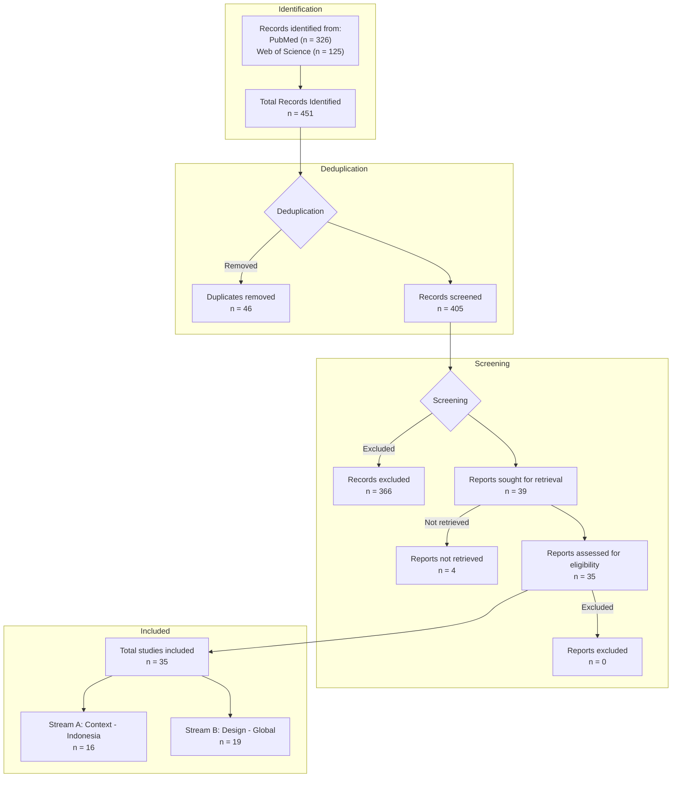

# PRISMA 2020 Flow Diagram

## Identification of Studies via Databases

**Databases Searched:** PubMed, Web of Science (WoS)

### 1. Identification
*   **Stream A (Context):**
    *   PubMed: 90
    *   Web of Science: 119
    *   *Subtotal:* 209
*   **Stream B (Design):**
    *   PubMed: 236
    *   Web of Science: 6
    *   *Subtotal:* 242

**Total Records Identified:** 451

### 2. Deduplication
*   **Duplicate Records Removed:** 46
    *   *Stream A internal duplicates:* 37
    *   *Stream B internal duplicates:* 1
    *   *Cross-Aim duplicates:* 8

**Records Screened:** 405

### 3. Screening
*   **Records Excluded:** 366
    *   *Reasons:* Wrong Setting (HIC), Wrong Tech (Non-Chat), Wrong Topic (Non-NCD/Other), Wrong Type (Review/Protocol/Abstract), One-way SMS.

**Reports Sought for Retrieval:** 39
*   **Reports Not Retrieved:** 4

**Reports Assessed for Eligibility:** 35
*   **Reports Excluded:** 0

### 4. Included
**Total Studies Included:** 35
*   **Stream A (Indonesia Context):** 16
*   **Stream B (Global Design):** 19

---

## Mermaid Diagram

